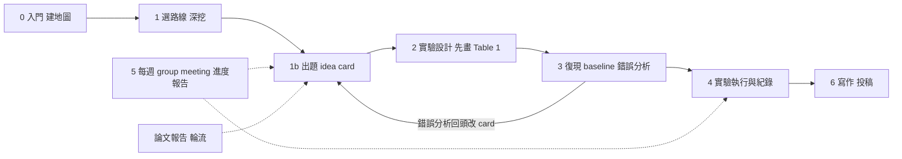

# Lab-Hub

SigSpeechAI-NTNU 實驗室的研究方法教材，給碩博班研究生。它教的是**從拿到一個題目到投出一篇會議論文**這條路上每一步怎麼做：怎麼用 AI 建文獻地圖並核對、怎麼寫出自己的 idea、怎麼設計實驗、怎麼復現與記錄、怎麼在 group meeting 報進度與報論文。目標不是「把題目做對」而已，是**投 top conference**——所以每一站都有「審稿人會怎麼看」的那一段。

教材是用來照著做的，不是用來讀過就算。每份都有步驟、要自己填的欄位（用 `〔〕` 標示）、產出長什麼樣、怎麼核對，以及「要先問教授的事」。

## 研究路徑

- 實線是主線，每站一份教材；第 6 站的教材還沒寫。
- 第 5 站「進度報告」從第 2 站起每週做；第 0、1 站不做每週報告，只在 Round 1 和 Round 2 做完各報一次。論文報告在 partner 組內輪流，讀到的論文會回到 1b 變成新的 card。
- 第 3 站做完錯誤分析要回 1b 改 card——出題不是一次性的，最能投的 idea 通常來自復現時看到的失敗。

## 一個會議週期大約長這樣（示例）

> 示例，以教授定的目標會議與截稿日為準；Round 2 的 one-pager 會從截稿日倒推出你自己的版本。

| 週 | 站 | 做什麼 | 結束時交什麼 |
|---|---|---|---|
| 1–4 | 0 | 建 repo、跑 Round 1、核對、親讀 5 篇 | 10 分鐘報告＋§9 問題，教授定路線 |
| 5–6 | 1 | Round 2、核對、補盲區 | one-pager，教授定題目與里程碑 |
| 7–8 | 1b＋2 | 寫 3–5 張 card，教授挑一張；畫 Table 1、消融表、method figure、論文骨架 | 設計文件，教授審過 |
| 9–11 | 3 | 復現必備 baseline 到對上數字；錯誤分析 100 個樣本 | 復現紀錄、錯誤分析；card 改版 |
| 12–13 | 2 | Pilot | 假設成立／放棄；不成立回 1b |
| 14–21 | 4 | 主實驗、消融、分析表；每週填 Table 1 | Table 1 填滿 |
| 22–24 | 6 | 初稿、內部審、投稿 | 投稿 |
| 每週 | 5 | 進度報告（第 7 週起）；論文報告輪流 | — |

大約 6 個月，對應一個 Interspeech 或 ICASSP 的週期；投 ML 主會（長論文）通常要再多 4–8 週的分析與寫作。哪一站落後 2 週以上，就是第 5 站「月度停損」要討論的時候。

## 教材清單（照路徑順序）

| 站 | 教材 | 什麼時候用 | 做完會有什麼 |
|---|---|---|---|
| 0 | [Deep Research 第一輪：建地圖](guides/deep_research/round1_map.md) | 教授給了一個題目或一段應用情境，你完全不熟，要在一個月內看懂全貌 | 核對過的地圖報告 `_r1_checked.md`、10 分鐘口頭報告 |
| 1 | [Deep Research 第二輪：深挖路線](guides/deep_research/round2_dive.md) | 和教授討論、選定一條技術路線後，以投一篇會議論文為目標 | `_r2_*.md`、教授改過的研究提案 one-pager |
| 1b | [出題：idea card 與 idea log](guides/ideation/idea_card.md) | Round 2 之後第一次寫；之後每次進度報告帶一張新的或改過的 | idea card、累積的 idea log（退掉的也留）、預測紀錄 |
| 2 | [實驗設計：先畫 Table 1](guides/experiment_design/design_table1.md) | 教授挑定你的 card 之後、寫任何程式之前 | Table 1 空表、消融表、方法圖、論文骨架、一頁決策紀錄（教授審過才開始寫程式） |
| 3＋4 | [復現 baseline、錯誤分析、實驗紀錄](guides/experiment_log/reproduce_and_log.md) | Table 1 審過之後，一直到投稿 | `results.csv`、實驗日誌、復現紀錄、錯誤分析、寫給外人看的 README |
| 5 | [進度報告：group meeting 怎麼報](guides/progress_report/group_meeting.md) | 每週（第 2 站起） | 8 頁 Quarto 投影片（含講稿）、GitHub Issue 上的教授回饋 |
| 貫穿 | [論文報告：把一篇論文變成投影片與講稿](guides/paper_reading/paper_to_slides.md) | 輪到你報論文時；每週 2 篇淺讀 | 13 頁英文投影片（中文講稿）、一頁核對紀錄、reading log |
| 6 | 從結果表到論文初稿 | — | （還沒寫） |
| 總表 | [要問教授的事](conventions/ask_professor.md) | 任何時候不確定「這該不該自己決定」 | 各站問題按時間排的一頁索引 |
| 慣例 | [審稿對帳](conventions/review_reconciliation.md) | 審稿意見回來的 48 小時內 | 一張「每條意見對回當初決策」的表；我容易漏的那一類 |

## 先讀哪份

- **剛進實驗室、教授剛給題目**：先從範本建自己的研究 repo（第 0 站操作方法第 0 步），然後第 0 站。跑完核對完，在 group meeting 報一次 10 分鐘，問 §9 的問題，教授定路線，再看第 1 站。
- **已經有題目、要開始做實驗**：1b → 2 → 3＋4，照順序，不要跳。第 2 站的 Table 1 沒經教授審過不要寫程式。
- **這週要報進度**：第 5 站。它假設你已經在做第 2–4 站的事。
- **這週輪到報論文**：貫穿那份。每三次輪到一次審稿預測練習（同一份教材 §10）。
- **不確定某件事該自己決定還是問教授**：總表。

## 四件先講清楚的事

- **AI 產出的報告是地圖，不是文獻。** 你在報告、投影片、論文裡引用的每一篇，都必須是你自己開過、讀過的。每份教材都有「怎麼核對」一節，那一節不是選讀。
- **AI 產出要標明。** 和教授討論時，說清楚哪些是 AI 的產出、哪些是你核對過的、哪些是你自己的判斷。教授要的是你的判斷。
- **題目、資料、GPU、目標會議由教授決定。** 教材裡會告訴你哪些問題要帶去問；不要自己猜。
- **你的 card 先講，教授後講。** Group meeting 固定順序：你報 card → 大家預測教授會怎麼判 → 教授才講。知道教授最後會給 idea 就會停止自己想，所以順序不能反。

## 你會用到的工具

| 工具 | 用在哪 | 哪份教材教 |
|---|---|---|
| AI 的 Deep Research 功能 | 第 0、1 站建地圖與深挖 | 第 0、1 站 |
| AI 的一般對話 | 核對報告、發散 idea、壓力測試 card、生投影片草稿、解釋看不懂的段落——每份教材都有「AI 怎麼用」與「不可以」 | 各站 |
| GitHub（lab 的 org `SigSpeechAI-NTNU`） | 你這個題目的一切：Deep Research 報告、設計文件、程式碼、實驗紀錄、投影片、每週報告的 Issue。拿到題目第一天就從範本 [`student-template`](https://github.com/SigSpeechAI-NTNU/student-template) 建，一題一個 repo | 第 0 站建，第 3＋4、5 站用 |
| Quarto | 進度與論文的投影片（qmd → html，含講稿，按 `S` 看講稿） | 第 5 站、論文報告 |
| Markdown | 日誌、idea log、決策紀錄、核對紀錄——所有給自己看的紀錄 | 各站 |
| arXiv、Google Scholar、OpenReview | novelty 檢查、Scholar alert、審稿預測練習 | 1b、第 1 站、論文報告 |

## 這個 repo 怎麼維護

教材由教授與 AI 共同編寫，教授定稿。改動都記在各檔尾的「修改紀錄」。發現教材寫不清楚、或照著做卡住，在本 repo 開 Issue 或直接跟教授說，那是教材要改的訊號。

repo 規範與待辦在 [`CLAUDE.md`](CLAUDE.md)。
