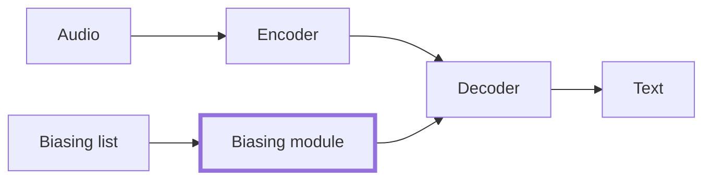

# 實驗設計：先畫 Table 1 再寫程式（v1.1，2026-10-03）

> 位置：第 2 站。前置是教授已經從你的 idea card 裡挑了一張（第 1b 站），手上有 Round 2 的 `_r2_*.md` 與 one-pager。
> 這一站的目的：**在寫任何程式之前**，把論文的主結果表、消融表、方法圖畫出來，並說清楚每一格的數字要從哪裡來。畫不出來的格子就是還沒做的決策。
> 產出：一個檔 `<題目>_design_<日期>.md`，放在你自己的研究資料夾（不放 Lab-Hub），內容四件：Table 1 空表、消融表空表、method figure、一頁決策紀錄。group meeting 上報，教授審過會在檔尾「審核紀錄」留一行；**沒有那一行之前不要開始寫程式**。
> 預設目標是長論文（8 頁以上的會議，例如 ICLR／NeurIPS／ACL 主會）。之後要投 4 頁的 ICASSP／Interspeech，照長論文版本修剪即可；反過來做不到。

---

## 0. 為什麼先畫表

論文的審稿人看的第一個東西是 Table 1。它回答三個問題：你跟誰比（欄）、在什麼資料上比（列）、贏多少（格子）。這三個問題分別對應你現在要做的三個決策：baseline、資料集、貢獻點。先把表畫出來，等於強迫自己在動手前把三個決策都做完；而且表畫好之後，之後每週的進度就是「填了哪幾格」，你和教授都看得到。

這一站的輸入：
- idea card 上的「痛點」「假設」「最接近的 prior work」「最小驗證」四格
- Round 2 §5（哪些 baseline 有可靠開源實作、建議先復現哪篇）
- Round 1 §4（常用資料集、指標、SOTA 數字表）

這一站**不重做搜尋**，只從上面的清單裡選。

---

## 1. 三張要畫的東西

### 1.1 Table 1：主結果表

格式固定如下。欄名用英文（之後直接進論文），每一格先不填數字，填**數字來源代碼**：

| 代碼 | 意思 | 什麼時候可以用 |
|---|---|---|
| `C` | cite，引用原論文的數字 | 只有在測試條件（資料集版本、切分、是否用外部 LM、模型規模）**完全相同**時 |
| `R` | reproduce，自己用開源實作重跑 | 必備 baseline 一定是 R；條件不同的 C 要改成 R |
| `O` | own，自己實作並跑 | 你的方法、消融 |
| `—` | 不跑 | 要在決策紀錄說明為什麼這格可以空 |

空表模板（`〔〕` 自己填）：

```markdown
Table 1: 〔一句話說這張表在比什麼〕

| Method | Params | 〔Dataset A〕 〔metric〕 | 〔Dataset A〕 〔metric 2〕 | 〔Dataset B〕 〔metric〕 | 〔Dataset B〕 〔metric 2〕 |
|---|---|---|---|---|---|
| 〔簡單 baseline〕 | | O | O | O | O |
| 〔必備 baseline〕 | | R | R | R | R |
| 〔最強公開 baseline〕 | | C 或 R | | | |
| 〔其他 baseline〕 | | | | | |
| Ours | | O | O | O | O |
```

**長論文的 Table 1 至少要有：** 2 個以上資料集（或同一資料集的 2 種條件，例如乾淨／雜訊、不同語言）、每個資料集 2 個指標（主指標＋一個說明代價或副作用的指標）、Params 或 FLOPs 一欄。4 頁論文可以砍到 1 個資料集 2 個指標。

### 1.2 消融表

列是「完整方法」與逐一拿掉一個成分的版本。只在**一個**資料集上做（主資料集），指標與 Table 1 相同。

```markdown
Table 2: Ablation on 〔Dataset A〕

| Variant | 〔metric〕 | 〔metric 2〕 |
|---|---|---|
| Ours (full) | O | O |
| − 〔成分 1〕 | O | O |
| − 〔成分 2〕 | O | O |
| − 〔成分 1〕 − 〔成分 2〕（＝必備 baseline） | R | R |
```

最後一列要和 Table 1 的必備 baseline 對得上——這是檢查你「只動一格」的方法：全部拿掉之後應該就是 baseline。對不上表示你改了不只一格。

### 1.3 Method figure

用 Mermaid 畫一張，之後寫論文再重畫成正式圖。要求：
- baseline 的部分用一種框，你新加的成分用另一種框（例如加粗邊），讀圖的人一眼看出你動了哪一格
- 節點標籤不含括號、引號、斜線
- 圖前用文字列出節點與邊



畫圖的用途不只是給論文：很多人畫到一半才發現自己的「新成分」其實接不進 baseline 的架構，或是要改的地方不只一處。

---

## 2. 貢獻點：只動一格

### 2.1 四種貢獻類型

第一篇論文只選一種。選定後，其餘全部與必備 baseline 相同：同 backbone、同訓練資料、同算力預算、同解碼設定。

| 類型 | 定義 | 「只動這一格」長什麼樣 |
|---|---|---|
| 新成分 | 在既有架構裡加一個模組 | 架構、損失、訓練流程不變，只多一個模組；消融就是拿掉它 |
| 新架構 | 改變資訊流的接法 | 模組本身可以沿用，改的是連接方式；消融是接回原來的接法 |
| 新學習方式 | 改訓練流程：預訓練目標、curriculum、資料增強、蒸餾 | 架構完全不變；消融是用原訓練流程訓同一個架構 |
| 新損失函數 | 改優化目標 | 架構與訓練流程不變；消融是換回原損失 |

idea card 上的「假設」要能對到其中一種。對不到，通常表示 idea 還是一個「方向」而不是一個「方法」，回 1b 再收斂。

### 2.2 一句話主張

寫在決策紀錄最上面，格式：

> 在〔任務〕上，〔baseline〕加上〔我的一格〕之後，〔主指標〕在〔資料集〕上改善〔預期幅度或「顯著」〕，代價是〔第二指標的變化〕。

寫不出「代價」那一段，表示你還沒想過副作用；審稿人一定會問。

### 2.3 長論文比短論文多什麼

長論文的審稿人要的不是「有效」，是「為什麼有效、什麼時候無效」。所以除了 Table 1 與消融，決策紀錄裡要預留：
- **一張分析表或圖**：把主指標按某個維度拆開（例如按詞頻、按語者、按雜訊程度），顯示改善集中在哪裡。這一張通常就是論文的賣點
- **一張代價表**：Params、訓練時間、推論 RTF（real-time factor，推論時間除以音檔長度）
- **一個失敗案例**：方法在什麼條件下沒用或更差，誠實寫

這三樣現在只要留標題與「打算怎麼拆」，不用畫表。

---

## 3. Baseline：四層，3–5 個

### 3.1 四層

| 層 | 是什麼 | 為什麼非有不可 | 來源代碼 |
|---|---|---|---|
| 簡單 baseline | 不加任何機制的版本 | 讓讀者看到問題本身有多難 | O |
| 必備 baseline | 這條路線人人都比的那個方法；通常就是 Round 2 §5 建議你復現的 | 沒有它，審稿人無法把你的數字放進文獻脈絡 | R |
| 最強公開 baseline | 目前有開源權重或程式碼的最強方法 | 審稿人一定問「為什麼不比 X」 | C（條件相同）或 R |
| 消融 baseline | 你的方法拿掉新成分 | 證明效果來自你改的那一格 | O（在消融表） |

每層至少一個，總數 3–5 個。少於 3 審稿人會問；多於 5 表示你還沒決定要跟誰比。

### 3.2 選入規則

每個 baseline 要能說出下面其中一條，說不出來就不要放：
- 在目標會議近兩年至少 2 篇同路線論文裡被當 baseline（Round 2 §8 的接受論文解剖會告訴你）
- 是你方法的直接前身（你的方法就是在它上面加一格）
- 是目前有公開權重的最強方法

### 3.3 公平比較的硬規定

1. **同 backbone、同資料、同算力預算、同解碼設定。** 任何一項不同，要在表格註腳寫出來
2. **引用數字只在測試條件完全相同時。** 資料集版本、切分、外部 LM、模型規模，任一不同就自己重跑
3. **Seed**：訓練集小於 100 小時的任務，跑 ≥3 個 seed，報平均±標準差；大資料集可以 1 個 seed，但要在表格註腳明說
4. **顯著性**：主結果附一種即可——bootstrap 95% 信賴區間，或配對檢定（WER 類常用 MAPSSWE 或 bootstrap）。在表格註腳用一句話交代，不要整段統計分析；審稿人要的是「差異不是雜訊」，不是統計課
5. **但書：第 3、4 條要和教授討論後定。** 語音領域的會議（ICASSP、Interspeech）審稿人通常不要求 multi-seed，因為語音資料量大、單次訓練成本高，測試集也夠大；ML 主會（ICLR、NeurIPS）則常要求。所以 seed 數與顯著性的做法依目標會議、資料量、算力三者決定，在決策紀錄的「公平比較」寫下和教授討論的結論，不要自己套規則
5. **報代價**：Params 或 FLOPs 一定要有；推論 RTF 在 streaming 或部署相關的題目一定要有

### 3.4 工具鏈：具體寫

Baseline 用什麼實作，決策紀錄裡要寫到 repo 名稱。語音常用的（以能取得、有維護為優先，請自行查證目前狀態）：

| 工具 | 適合 | 備註 |
|---|---|---|
| ESPnet | ASR、TTS、語音翻譯，recipe 最齊 | 很多論文的 baseline 數字就是用它的 recipe 跑出來的 |
| SpeechBrain | ASR、說話人、增強，程式碼好讀 | 適合要改內部模組的題目 |
| NVIDIA NeMo | 大模型 ASR、Conformer／FastConformer checkpoint | 吃 GPU，但 checkpoint 多 |
| Hugging Face transformers | Whisper、wav2vec 2.0、HuBERT、WavLM 的 checkpoint | 微調方便；要改架構比較麻煩 |
| icefall（k2） | transducer／CTC 的高效實作 | streaming 題目常用 |
| WeNet | 產品導向的 ASR，streaming 支援好 | 中文語料 recipe 多 |

預訓練 backbone 常見選項：wav2vec 2.0、HuBERT、WavLM、Whisper、各 toolkit 的 Conformer checkpoint。選哪個問教授——lab 可能已經有慣用的，而且和 GPU 記憶體有關。

---

## 4. 資料：三層，一條硬規則

### 4.1 三層

| 層 | 是什麼 | 什麼時候用 | 在 Table 1 的位置 |
|---|---|---|---|
| A 標準公開 | Round 1 §4 表格裡大家都報的那幾個 | **主實驗至少一個，沒得商量** | 第一組列 |
| B 公開但要自己組 | 把公開語料重組出你要的條件：加雜訊、挑出含專有名詞的句子、混合兩種語言 | 當你的主張是「在某條件下更好」 | 第二組列，或分析表 |
| C 自己蒐集／錄製／標記 | 台灣華語、臺語、特定場域、既有資料完全沒有的現象 | 只在研究問題**非它不可**時 | 第二組列或分析表；**永遠不是唯一的評測集** |

**硬規則：自建資料是第二個資料集或分析用集，不是主表的唯一來源。** 審稿人對只在自建資料上贏的論文打折很重，因為無法和任何已發表的數字比。

### 4.2 具體的 A 層候選（語音；請自行查證目前的取得方式與版本）

| 資料集 | 語言 | 適合 | 備註 |
|---|---|---|---|
| LibriSpeech | 英語朗讀 | ASR 主實驗的預設 | test-clean／test-other 兩個測試集都要報 |
| Common Voice | 多語言，含 zh-TW | 多語言、口音、台灣華語 | 版本號一定要寫；每版數字不同 |
| AISHELL-1 | 中文朗讀 | 中文 ASR 主實驗的預設 | AISHELL-2 要申請 |
| GigaSpeech | 英語，多領域 | 大規模、領域泛化 | 有 XS 到 XL 子集，寫清楚用哪個 |
| TED-LIUM 3 | 英語演講 | 自發語音 | |
| Earnings-21／22 | 英語財報電話 | 專有名詞、長音檔 | contextual biasing 類題目常用 |

A 層以外的（Switchboard、Fisher 等 LDC 語料）要授權；教材不處理授權，問教授 lab 有沒有。

### 4.3 B 層怎麼組

決策紀錄要寫：從哪個 A 層資料集、用什麼規則挑或改、挑完多少句、怎麼確認挑出來的真的是你要的條件（抽 50 句人工看）。規則要能用一段程式碼重現；審稿人會要求釋出。

### 4.4 C 層動工前的檢查

| 項目 | 要回答的問題 |
|---|---|
| 非它不可 | A、B 兩層為什麼做不到？寫一句 |
| 時程 | 截稿日還有幾個月？**不到 4 個月不開新蒐集**，除非 lab 已經有 |
| 成本 | 先錄 30 分鐘 pilot，實測「每小時語音要幾小時標記」，再乘上目標時數 |
| 標記指引 | 寫一頁，兩個人各標同一段 10 分鐘，算一致性（inter-annotator agreement）；低於八成要改指引 |
| 切分 | 說話人不重疊的 train／dev／test |
| 規模 | 和文獻裡同類自建資料集比，夠不夠？Round 1 §4 有數字 |
| 受試者 | 錄別人的聲音要有同意書與去識別化；校內研究倫理規定請自行查證並問教授 |
| 釋出 | 能不能公開？一行即可，不用現在解決 |

合成資料（TTS 生成語音、LLM 生成文本）是正當手段，可以當訓練資料或 B 層的一部分；**測試集必須是真實資料**。

---

## 5. Pilot 與放棄判準

Table 1 畫好之後，不要直接開主實驗。先做一個 **2 週內能做完**的最小實驗，它只回答一個問題：假設成立嗎？

決策紀錄裡寫三行：
- **Pilot 是什麼**：縮小版的主實驗——小資料集、小模型、少 epoch，只跑「必備 baseline」與「Ours」兩列
- **什麼結果算成立**：例如「主指標相對改善 ≥ 〔x〕%，且不是 seed 雜訊」
- **什麼結果就放棄或改**：例如「改善 < 〔y〕% 或第二指標惡化超過〔z〕」→ 回 1b 改 card，不要加大實驗硬撐

Pilot 的數字不進論文。它的用途是讓你在第 2 週而不是第 3 個月知道方向錯了。

---

## 6. 決策紀錄：一頁

和三張表放同一個檔。模板：

```markdown
# 〔題目〕實驗設計 v〔1〕 〔YYYY-MM-DD〕

## 一句話主張
在〔任務〕上，〔baseline〕加上〔我的一格〕之後，〔主指標〕在〔資料集〕上改善〔幅度〕，代價是〔　〕。

## 貢獻類型
〔新成分／新架構／新學習方式／新損失函數〕；動的那一格是：〔　〕

## Baseline
| 名稱 | 層 | 實作來源（repo） | 來源代碼 | 選入理由（§3.2 哪一條） |
|---|---|---|---|---|

## 資料集
| 名稱 | 層 | 版本／切分 | 用途（主表／消融／分析） | 選入理由 |
|---|---|---|---|---|

## 公平比較
backbone：〔　〕 訓練資料：〔　〕 算力預算：〔　〕 解碼：〔　〕 seed 數：〔　〕 顯著性：〔方法〕

## 長論文預留
分析維度：〔按什麼拆〕 代價表：〔Params／RTF〕 預期失敗情境：〔　〕

## Pilot
內容：〔　〕 成立判準：〔　〕 放棄判準：〔　〕 預計完成：〔日期〕

## 空格說明
Table 1 裡每個 `—` 的理由：〔　〕

## 要問教授的事與答案
| 問題 | 答案 | 日期 |
|---|---|---|

## 審核紀錄
| 日期 | 版本 | 場合 | 結論 |
|---|---|---|---|
| | v1 | group meeting | 〔教授填：通過／修改後再報／退回 1b〕 |
```

教授審過的結論由教授填或你照教授的話填，填完才算通過。審核紀錄每一版都留，不覆蓋。

---

## 7. 示例：contextual biasing STT

> **以下全部是示例。** 資料集、指標、baseline 的「種類」是真的；數字、方法名稱、改善幅度是虛構的，只示範格式。

**題目**（示例）：語音辨識在使用者講到人名、產品名等罕見詞時常認錯；給模型一份「可能出現的詞」清單（biasing list），讓它偏向辨識出清單裡的詞。

**一句話主張**（示例）：在 LibriSpeech 上，attention-based deep biasing 加上「biasing list 的發音感知編碼」之後，biased-word WER 在 test-other 上改善 15% 相對值，代價是 unbiased-word WER 持平、推論 RTF 增加 5%。

**貢獻類型**：新成分（動的那一格：biasing list 的編碼器）。

**Table 1**（示例；B-WER = biasing list 內的詞的錯誤率，U-WER = 清單外的詞的錯誤率）：

| Method | Params | test-clean WER | test-clean B-WER | test-other WER | test-other B-WER | test-other U-WER |
|---|---|---|---|---|---|---|
| No biasing（簡單） | | O | O | O | O | O |
| Shallow fusion with biasing LM（必備之一） | | R | R | R | R | R |
| Attention-based deep biasing（必備，直接前身） | | R | R | R | R | R |
| 〔Round 2 §5 列出的最強開源方法〕 | | C 或 R | | | | |
| Ours | | O | O | O | O | O |

**消融表**（示例）：

| Variant | test-other WER | test-other B-WER |
|---|---|---|
| Ours (full) | O | O |
| − 發音感知編碼（換回原本的字元編碼） | O | O |
| − 整個新成分（＝attention-based deep biasing） | R | R |

**長論文預留**（示例）：分析維度——按 biasing list 長度（10／100／1000 詞）拆 B-WER，預期 list 越長改善越明顯；代價表——Params、RTF；預期失敗情境——list 裡有同音異字時可能更差。

**Pilot**（示例）：LibriSpeech train-clean-100 訓一個小 Conformer，只跑 attention-based deep biasing 與 Ours，各 1 seed；成立判準：test-other B-WER 相對改善 ≥ 8%；放棄判準：< 3% 或 U-WER 惡化 > 2% 絕對值。

**空格說明**（示例）：最強開源方法只在 test-other 報 C，因為原論文只報那個集；若教授要求全報，改 R。

---

## 8. 怎麼核對

這一站的核對只有兩件事，但都要親手做：

1. **每個 `C` 格**：打開原論文，找到那個數字所在的表格，確認資料集版本、切分、外部 LM、模型規模與你的設定完全一致。有一項不一致就改成 `R`。把論文的表格編號與頁碼記在決策紀錄的 baseline 表裡
2. **每個資料集**：到官方頁面確認版本號與標準切分；Common Voice 這類有版本的，寫到版本號。Round 1 §4 表格裡的數字若和你查到的不同，以官方頁面為準，並回頭在 `_r1_checked.md` 標註

AI 可以幫你列候選、幫你檢查表格格式；AI 不能替你開論文對數字。

---

## 9. 要問教授的事

帶著畫好的三張表去問，不要空手問。

| 問題 | 為什麼影響設計 |
|---|---|
| lab 慣用的工具鏈與 backbone 是哪個？有沒有現成的 checkpoint？ | 決定必備 baseline 用 R 要花幾天 |
| GPU 型號、數量、能獨占多久？ | 決定最強公開 baseline 跑不跑得動、seed 數能不能到 3 |
| lab 有哪些語料？ | 決定 B、C 層有沒有現成的可以用 |
| 目標會議與截稿日？ | 決定 C 層能不能開、pilot 的截止日 |
| 這個題目和 lab 既有的工作有沒有重疊？ | 避免和同學做到同一格 |
| 最強公開 baseline 跑不動的話，可以降一層嗎？ | 要在論文裡明說，教授決定能不能接受 |

---

## 修改紀錄

### v1.1（2026-10-03）
- §3.3 加第 5 條但書：seed 數與顯著性依目標會議、資料量、算力和教授討論後定；語音會議通常不要求 multi-seed

### v1（2026-10-03）
- 初版。設計決策見 `CLAUDE.md` 第五節：預設長論文；baseline 四層 3–5 個；seed 與顯著性規則；資料三層與自建資料硬規則；示例用 contextual biasing STT，baseline 以方法類型標示不綁定論文；研究倫理只寫原則
