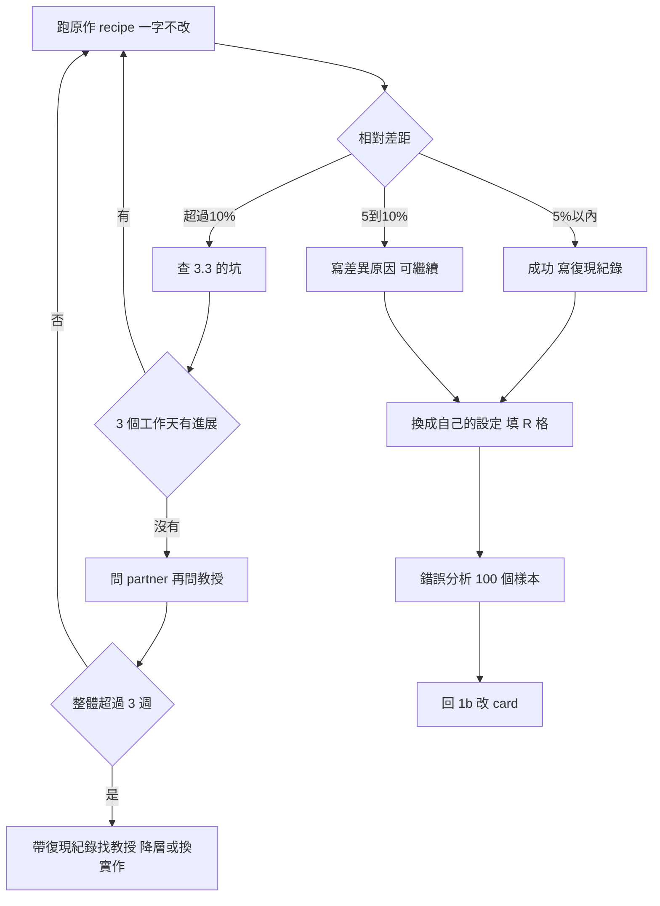

# 復現 baseline、錯誤分析、實驗紀錄（v1.7，2026-10-08）

> 位置：第 3 站與第 4 站，合寫一份。前置是第 2 站的 `_design.md` 已經有教授的審核紀錄。
> 這一站的目的有三個，依序做：(1) 把 Table 1 的必備 baseline 復現到對上論文數字；(2) 分析它錯在哪，回第 1b 站改 card；(3) 從此之後每一個實驗都用同一套方式記錄，Table 1 的格子從紀錄裡填。
> 產出：repo 裡的 `results.csv`、實驗日誌、復現紀錄、錯誤分析，以及一份**寫給外人看的 README**（目的、安裝、怎麼跑、目前結果）。
> 鐵律：**復現沒對上之前，不改方法。** 這條在 Round 2 操作方法第 11 點已經寫過，這裡重申，因為它是學生最常違反的一條。

---

## 0. 這一站怎麼接前後

- 輸入：`_design.md` 裡的 Table 1——復現的對象就是標 `R` 的必備 baseline；Round 2 §5 的「建議先復現哪篇、復現判準、常見的坑」
- 輸出到 1b：錯誤分析的結論（§5）是 idea card 來源 2 的材料
- 輸出到第 5 站：實驗日誌每週結尾那一段「本週 Table 1 填了哪幾格」直接拿去報
- 輸出到第 2 站：復現成功後，把 Table 1 的 `R` 格填上數字

---

## 1. 開跑之前先建三樣東西

第一個實驗跑之前就要有，不是之後補。

### 1.1 Repo 與 README

你的 repo 在第 0 站就從範本 `SigSpeechAI-NTNU/student-template` 建好了（lab org 底下、private、教授是 collaborator、命名 `〔名字〕_〔題目簡稱〕`）。一個題目一個 repo，**所有東西都跟著題目走**——論文筆記、idea log、週報也在裡面，不另開個人 repo。題目結束（投稿後）repo 封存，開新題目時把 `notes/idea_log.md` 與 `notes/papers/` 複製到新 repo，其餘不帶。Repo 名一開始用 Round 1 的題目簡稱，題目收斂後到 GitHub Settings 改名（會自動轉址，本地 `git remote set-url` 即可）。partner 做的是不同題目，各有各的 repo，只互看。結構照範本：

```
〔名字〕_〔題目簡稱〕/
  README.md          寫給外人看的：目的、安裝、怎麼跑、目前結果（見下）
  research/          Deep Research 報告、one-pager（第 0、1 站）
  design/            設計文件：Table 1、消融表、決策紀錄（第 2 站）
  configs/           每個 run 一個 config 檔，檔名＝run_id
  scripts/           訓練、評測、資料準備的腳本；run.sh 一行能跑
  results/
    results.csv      一行一個 run（格式見 1.2）
    error_analysis.csv
  notes/
    log.md           實驗日誌（格式見 1.3）
    reproduce.md     復現紀錄（格式見 3.4）
    idea_log.md      idea card（1b）
    papers/          論文核對紀錄、reading_log.md
  reports/           進度與論文報告的 qmd 與 html（第 5 站）
  pyproject.toml     環境定義（uv）；uv.lock 與 .python-version 一起進 git
  .gitignore
```

**README 的規格**——它是這個 repo 唯一寫給「沒看過你任何東西的人」的檔案，教授、partner、一年後的學弟妹、審稿時的 artifact reviewer 都從這裡進來。五段，範本已有骨架：

| 段 | 寫什麼 | 什麼時候更新 |
|---|---|---|
| 目的 | 題目一句話、一句話主張（第 2 站的）、對應的設計文件 | 第 2 站審過後 |
| 安裝 | `uv sync` 一行；Python 版本（`.python-version`）、CUDA／PyTorch／toolkit 版本、資料與 checkpoint 放哪 | 第一個 run 之前 |
| 怎麼跑 | `scripts/run.sh configs/<run_id>.yaml`；復現 baseline 用哪個 config、主實驗用哪個 | 每加一種 run 就補 |
| 目前結果 | **Table 1 的現況**（從 `results.csv` 抄，標日期），和論文數字的對照 | **每週**，和週報同步 |
| 結構 | 資料夾對照表（範本已有） | 不用動 |

「目前結果」那段是最重要的：教授打開 repo 第一眼看的就是它。它和投影片第 4 頁是同一張表，週報做好順手更新。

**不進 git 的東西**：資料集、checkpoint、任何金鑰或 token、超過幾 MB 的 log。範本的 `.gitignore` 已經擋了常見的；資料和 checkpoint 放機器上，路徑寫在 README。

每個 run 跑之前 commit 一次，commit hash 記進 `results.csv`——這樣任何一個數字都能回到產生它的那版程式碼。

### 1.2 `results.csv`

一行一個 run，欄位固定：

```
run_id,date,config_path,dataset,split,metric,value,seed,git_commit,note
```

- `run_id`：`YYYYMMDD_〔短名〕_s〔seed〕`，例如 `20261015_deepbias_s0`。config、log 檔用同一個名字
- 一個 run 多個指標或多個測試集就多行，`run_id` 相同
- `note` 一句話：這個 run 改了什麼、或為什麼失敗。失敗的 run 也要記，`value` 填 `NA`，note 寫原因
- **不刪列**。錯的、失敗的、後來推翻的都留，用 note 標

Table 1 的每一格就是從這個檔篩出來的：同 dataset、同 split、同 metric、取某個 run。之後可以寫一個小腳本從 `results.csv` 直接產生 Table 1 的 Markdown，不用手抄。

### 1.3 實驗日誌 `notes/log.md`

一天一節，當天寫，不要週末補：

```markdown
## 2026-10-15
- 跑了：〔run_id〕，改了〔什麼〕
- 結果：〔數字或「還在跑」〕
- 卡住：〔問題；試過什麼〕
- 下一步：〔明天做什麼〕
```

每週最後一天多一段，欄位和第 5 站進度報告的五格一樣：

```markdown
### 本週小結（〔MM/DD–MM/DD〕）
- 對帳：上週說要做〔　〕→ 做到了〔是／否：原因〕
- Table 1 填了：〔哪幾格，數字，run_id〕；距上次新數字〔N〕週
- 卡住：〔問題／試過／卡在哪〕
- Card：〔編號與一句話；新的或改了哪格〕
- 下週與要問教授：〔　〕
- 本週淺讀：〔2 篇短名〕
```

這一段就是第 5 站進度報告的骨架，也是 README「目前結果」要更新的時候。

### 1.4 訓練曲線用 W&B（建議，不強制）

`results.csv` 記的是每個 run 的最終數字；訓練過程的 loss、learning rate、GPU 用量這類**曲線**，建議用 [Weights & Biases](https://wandb.ai/)（學術帳號免費）。復現對不上數字時，第一件事就是比你的 loss 曲線和原作的——沒有工具你會自己拼 matplotlib。分工寫死：

| | `results.csv` | W&B |
|---|---|---|
| 管什麼 | 每個 run 的最終數字；Table 1 從這裡填 | 訓練曲線、超參數、GPU 用量 |
| 真相來源 | **是**；不刪列、有 commit hash | 不是；只看趨勢，數字以 csv 為準 |
| 對得上嗎 | — | 每個 W&B run 的 config 記 `run_id` 與 `git_commit`，和 csv 同名 |

三條規則：
- `uv add wandb`；W&B 的 project 設 **private**（裡面是未發表結果），project 名用 repo 名
- `wandb.init(name=run_id, config={..., "git_commit": ...})`——名字和 csv 的 `run_id` 一字不差，之後才對得回去
- W&B 掛了、或機器沒網路，實驗照跑、csv 照記；它是輔助，不是流程的一部分

不想用 W&B 的話，把曲線存成 `results/curves/<run_id>.csv` 自己畫也可以；規則一樣，數字以 `results.csv` 為準。

---

## 2. 環境重現：只用 uv

目標：三個月後的你、或你的 partner，能在另一台機器上跑出同一個數字。

**lab 的 Python 環境一律用 [uv](https://docs.astral.sh/uv/) 管理，不用 conda、不用裸 pip、不用 poetry。** 理由：一個 `pyproject.toml` 加一個 `uv.lock` 就把 Python 版本與每個套件的精確版本鎖死，`uv sync` 一行在任何機器重建；lock 檔進 git，所以 `results.csv` 的每個 commit hash 都對應一個可重建的環境。範本已附 `pyproject.toml` 與 `.python-version`，你要做的只有：

```
uv sync                      # 建 .venv、裝 lock 檔裡的版本
uv add <套件>                # 加套件（會更新 pyproject.toml 與 uv.lock，一起 commit）
uv run scripts/run.sh ...    # 跑任何東西都用 uv run，不要手動 activate
```

三個會踩到的地方：
- **PyTorch 的 CUDA 版本**：PyTorch 不是從 PyPI 預設 index 裝的，要在 `pyproject.toml` 的 `[tool.uv.sources]` 指定 PyTorch 的 index（哪個 CUDA 版本對應哪個 index，照 PyTorch 官網與 uv 文件的說明，請自行查證目前寫法）。範本留了註解位置
- **toolkit（ESPnet、SpeechBrain 等）**：能 `uv add` 的就 `uv add`；要改內部程式的，fork 後用 `uv add --editable <本機路徑>` 或 git submodule，commit hash 記在 README
- **非 Python 的依賴**（sox、ffmpeg、CUDA toolkit）：uv 管不到，寫在 README「安裝」段，用機器的套件管理或 module 裝

| 要做的 | 怎麼做 |
|---|---|
| 固定 Python 與套件版本 | `pyproject.toml`、`uv.lock`、`.python-version` 三個檔進 git；**不要**手寫 `requirements.txt` |
| 記錄系統版本 | README「安裝」段寫 CUDA、cuDNN、PyTorch、GPU 型號 |
| 所有 seed 寫進 config | Python、NumPy、PyTorch 的 seed；data loader 的 shuffle seed |
| 資料版本 | 資料集版本號、切分檔的 md5 或行數，寫在 README「安裝」段 |
| 一行就能重跑 | `uv run scripts/run.sh 〔config〕` 就能從頭跑；不能的話寫在 README「怎麼跑」段 |

lab 的 GPU 是學校的機器，共用規矩（排隊、能佔幾張、跑多久要說）問教授或 partner；教材不寫，因為會變。

---

## 3. 復現 baseline



### 3.1 步驟

1. **先跑原作的 recipe，一個字都不改。** 用原作的 repo、原作的 config、原作的資料切分，目標是對上論文裡那個數字。改任何東西（包括「我只是換成 lab 的資料路徑」以外的事）都等對上之後
2. 對上了，commit，寫復現紀錄（3.4）
3. 然後才換成你的設定：你的資料、你的 backbone、你 Table 1 的測試條件。這一步的數字會不一樣，但你知道差異來自設定不是 bug
4. 把這個數字填進 Table 1 的 `R` 格

### 3.2 判準

同設定下，主指標與論文數字的差距：

| 相對差距 | 怎麼辦 |
|---|---|
| ≤ 5% | 復現成功。寫紀錄，往下走 |
| 5–10% | 可以繼續，但要在復現紀錄寫「差異可能原因」，group meeting 報告時講 |
| > 10% | 先找原因；3 週內找不到，帶著「試過什麼」清單找教授 |

WER 之外的指標（EER、PESQ、BLEU、accuracy）暫時同一套；教授會依題目調整。「相對差距」是 |你的 − 論文的| ÷ 論文的。

### 3.3 常見的坑（語音）

對不上數字時先查這些，九成的差異在這裡：

| 坑 | 查什麼 |
|---|---|
| 資料集版本或切分 | 論文用的是哪一版、哪個 test set；Common Voice 每版數字不同 |
| 文字正規化 | 大小寫、標點、數字寫法、縮寫；WER 差 1–2% 常常只是正規化不同 |
| 外部語言模型 | 論文有沒有用 LM rescoring、shallow fusion；權重多少 |
| 解碼參數 | beam size、length penalty、CTC weight |
| Checkpoint averaging | 很多 recipe 平均最後 N 個 epoch 的權重；論文數字常是平均後的 |
| 取樣率與特徵 | 16 kHz 還是 8 kHz；fbank 維度；是否 SpecAugment |
| 訓練長度 | epoch 數、batch size、學習率排程；GPU 少的時候 batch 變小，數字會掉 |
| 預訓練權重版本 | wav2vec 2.0、Whisper 等有多個版本與大小 |

### 3.4 復現紀錄 `notes/reproduce.md`

```markdown
# 復現：〔baseline 名稱〕

- 論文：〔標題、URL〕；對的是表〔N〕第〔M〕列，〔資料集／split／指標〕＝〔論文數字〕
- 實作：〔repo URL、commit hash〕
- 環境：〔GPU 型號×數量、CUDA、toolkit 版本〕
- 我的數字：〔　〕（run_id：〔　〕）；相對差距〔　〕%
- 判定：〔成功／可繼續／未對上〕
- 差異可能原因：〔　〕
- 踩的坑：〔一行一個；下一個復現的人會感謝你〕
- 花的時間：〔天〕
```

---

## 4. 卡住的規則

- 同一個問題**超過 3 個工作天**沒進展：先找 partner 討論，partner 也不會就直接問教授。不要自己再磨一週
- 問之前整理三行：問題是什麼、試過什麼、現在卡在哪一步。這三行貼進日誌的「卡住」欄
- 復現整體**超過 3 週**沒對上：帶著 `reproduce.md` 找教授，由教授決定繼續找、降一層 baseline、或改用別的實作

partner 是教授指定的、做相關議題的 2–3 個人，各自有主要負責的題目但彼此知道對方在做什麼。復現的坑常常 partner 已經踩過。

---

## 5. 錯誤分析

復現成功後、開始改方法之前做。它的產出是回 1b 寫 card 的材料。

### 5.1 步驟

1. 從 test set 的錯誤樣本裡隨機抽 **100 個**。語音題目一定要**親耳聽**音檔，不要只看文字
2. 自己先擬 **5–8 個**錯誤類別（例如：罕見詞、同音詞、雜訊、說話人口音、切字錯誤、插入／刪除）。類別要互斥、要能從樣本判斷
3. 每個樣本標一類，記進 `results/error_analysis.csv`：

```
sample_id,reference,hypothesis,category,human_can_tell,note
```

`human_can_tell`：你聽得出正確答案嗎（Y／N）。**人聽得出但模型錯的**才是方法的問題；人也聽不出的是資料問題
4. 算每類佔幾成；最大的一類再看一次，寫下共同點
5. 類別與比例在 group meeting 上報，教授會改類別；改完重標一次（100 個樣本重標半天就好）

### 5.2 產出

日誌裡一段：

```markdown
### 錯誤分析（〔baseline〕，〔dataset／split〕，〔日期〕）
- 抽 100 個錯誤樣本，類別與比例：〔表〕
- 最大一類：〔類別〕，〔x〕%，共同點：〔　〕
- 人聽得出但模型錯的佔：〔y〕%
- 回 1b：這指向〔什麼 idea〕；card 編號〔　〕
```

最後一行就是 idea card 的「痛點」格與證據。

---

## 6. 之後的每一個實驗

復現與錯誤分析做完，教授挑了 card、Table 1 審過，就進入填格子的階段。規則：

0. **任何新程式或新 config，先拿 10 句話訓到 loss 接近 0。** 過不了就是 bug，不是超參數；過了才開真正的訓練。這一步 10 分鐘，省掉「跑三天發現 loss 沒降」
1. **一個 run 只改一個東西。** 改了兩個就不知道效果來自哪個。要試組合，先各自跑過
2. 跑之前 commit，`git_commit` 進 `results.csv`
3. 跑完當天記日誌，不管結果好壞
4. seed 數照 `_design.md` 「公平比較」寫的做；主結果的 run 跑完才跑 seed，不要每個嘗試都跑三個 seed
5. 數字比 baseline 好得不像話（相對改善 > 30%）時，**先懷疑 bug**：test set 有沒有混進訓練、評測腳本對不對、正規化是否一致
5b. **評測腳本在填第一格 Table 1 之前，partner 盲測一次**：你給 partner 一份 20 句的小集合（含參考文字）與你的評測指令，他自己算 WER 或主指標，和你的腳本對；對不上先修腳本。研究生論文最常見的錯不在方法，在評測——正規化、切分洩漏、指標算法。一小時的事，擋掉投稿後最難看的那種錯
6. 每週小結對照 Table 1：填了幾格、還剩幾格、以目前速度截稿前填得完嗎。填不完要提早說，教授才能決定砍格子還是改投下一個場合

---

## 7. 示例

> **示例，數字虛構。** 延續 contextual biasing STT。

`results.csv` 的幾行：

```
run_id,date,config_path,dataset,split,metric,value,seed,git_commit,note
20261015_deepbias_s0,2026-10-15,configs/20261015_deepbias_s0.yaml,LibriSpeech,test-other,WER,8.9,0,a1b2c3d,原作 recipe 不改
20261015_deepbias_s0,2026-10-15,configs/20261015_deepbias_s0.yaml,LibriSpeech,test-other,B-WER,21.4,0,a1b2c3d,原作 recipe 不改
20261018_deepbias_s0,2026-10-18,configs/20261018_deepbias_s0.yaml,LibriSpeech,test-other,WER,NA,0,b2c3d4e,OOM 爆掉 batch 太大
20261019_deepbias_s0,2026-10-19,configs/20261019_deepbias_s0.yaml,LibriSpeech,test-other,WER,9.1,0,c3d4e5f,batch 減半 lr 跟著調
```

`reproduce.md` 的核心幾行：

```markdown
- 論文：〔attention-based deep biasing 的那篇，URL〕；對的是表 2 第 3 列，LibriSpeech test-other B-WER＝20.8
- 我的數字：21.4（run_id：20261015_deepbias_s0）；相對差距 2.9%
- 判定：成功
- 踩的坑：原 recipe 的文字正規化把 's 拆開，我們的評測腳本沒拆，WER 差了 0.6 才發現
- 花的時間：11 天
```

錯誤分析的結論：

```markdown
- 最大一類：同音／近音詞混淆，38%，共同點：biasing list 裡同時有兩個以上發音相近的候選
- 人聽得出但模型錯的佔：71%
- 回 1b：指向「biasing list 的編碼要有發音資訊」；card C03
```

---

## 8. 怎麼核對

1. **復現數字**：對回論文的表格編號與列，確認 split 與指標名稱一字不差；論文的數字抄進 `reproduce.md` 時附頁碼
2. **`results.csv` 與 Table 1**：每個填進 Table 1 的數字都能在 `results.csv` 找到一行、那一行有 commit hash、那個 commit 能 checkout 出來
3. **錯誤分析**：隨機抽 10 個已標的樣本，請 partner 盲標一次；對不上超過 3 個就要重定義類別
3b. **評測腳本**：§6 第 5b 條的 partner 盲測做過、對上了，日誌記一行
4. AI 可以幫你寫腳本、查 toolkit 的 config 怎麼設；復現對不對、錯誤樣本是哪一類，要你自己聽、自己看

---

## 8b. 審稿人會怎麼看這一站的產出

這一站的產出大多不直接進論文，但審稿人問的三件事全靠它：
- **「你的 baseline 數字比原論文差，是不是沒調好？」** 復現紀錄（§3.4）就是答案：對到論文哪一表、差距幾 %、差異原因。對上了才有資格說自己的方法贏
- **「WER 怎麼算的？正規化？有沒有洩漏？」** §6 第 5b 條的評測盲測與 §3.3 的坑清單，就是在投稿前先替審稿人問一遍。這類問題一旦被抓到，整篇論文的數字都不算數
- **「能不能重現？」** `results.csv` 的 commit hash、config 進 git、README 的安裝與怎麼跑——越來越多會議有 reproducibility checklist 或 artifact review，這一站做好的人填那張表只要十分鐘

錯誤分析（§5）則是你自己當審稿人：在 baseline 身上找它壞在哪，正是審稿人之後會在你的方法身上做的事。

---

## 9. 要問教授的事

| 問題 | 什麼時候問 |
|---|---|
| 我的 partner 是誰？ | 第一週 |
| GPU 的共用規矩？ | 第一個 run 之前 |
| 復現超過 3 週對不上，降一層 baseline 可以嗎？ | 帶著 `reproduce.md` 問 |
| 錯誤類別這樣分可以嗎？ | 標完 100 個的那次 group meeting |
| seed 數與顯著性做法（第 2 站 §3.3 的但書） | 主結果的 run 跑之前 |
| 以目前速度截稿前填不完 Table 1，砍哪幾格？ | 一發現就問，不要等 |

---

## 修改紀錄

### v1.7（2026-10-08）
- §1.4 加「訓練曲線用 W&B」：建議不強制；曲線歸 W&B、數字歸 results.csv；run 名與 run_id 一致、project 設 private

### v1.6（2026-10-08）
- §2 環境管理限定 uv：pyproject.toml＋uv.lock＋.python-version 進 git，`uv sync`／`uv add`／`uv run`；PyTorch CUDA index、toolkit、非 Python 依賴三個注意點；README 安裝段同步

### v1.5（2026-10-08）
- 加 §8b「審稿人會怎麼看這一站的產出」

### v1.4（2026-10-08）
- §3 加復現判準與卡住規則的流程圖

### v1.3（2026-10-08）
- §1.1 明定：一切跟著題目走、不開個人 repo；題目結束時 idea log 與 papers 複製到新 repo；repo 可改名
- §1.1 改為「repo 第 0 站已建」，結構對齊範本，加 README 五段規格（目的／安裝／怎麼跑／目前結果／結構），「目前結果」每週更新
- §1.3 週小結改為和第 5 站五格一致，加淺讀

### v1.2（2026-10-08）
- §6 加第 0 條「10 句話過擬合」與第 5b 條「評測腳本 partner 盲測」；§8 同步

### v1.1（2026-10-08）
- §1.1 補從範本 repo 建立

### v1（2026-10-03）
- 初版。設計決策見 `CLAUDE.md` 第五節：repo 在 `SigSpeechAI-NTNU` 底下、private、命名 `〔名字〕_〔題目簡稱〕`；不強制追蹤工具，必備 config 進 git＋`results.csv`＋日誌；復現判準相對 ±5%／±10%；卡住 3 天先找 partner 再問教授、復現 3 週找教授；錯誤分析 100 個樣本親耳聽、學生先擬 5–8 類
