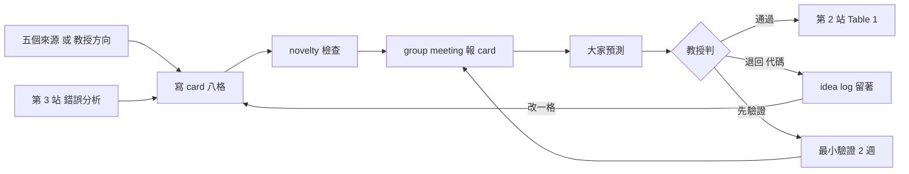
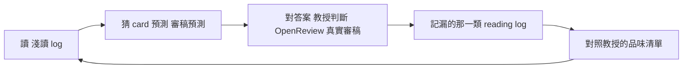

# 出題：idea card 與 idea log（v1.5，2026-10-09）

> 位置：第 1b 站。第一次做是在 Round 2 的 one-pager 出來、和教授討論過之後；之後**每次進度報告都帶一張新的或改過的 card**；第 3 站復現 baseline 做完錯誤分析後，要回來重寫。
> 這一站的目的：把「我覺得可以做 X」寫成教授一眼能判斷的半頁，並把每一張都留下來，累積成你自己的 idea log。
> 這份教材教的是**怎麼寫 card**，不是怎麼想出好 idea。好 idea 靠專業知識累積，前幾個月的 card 不好是正常的；但寫 card 的習慣第一週就要有。
> 第一條規則：**不可以拿 AI 生的 idea 直接去跟教授報。** AI 可以用，用法見 §6。
> **參與產學計畫的人**：痛點可以來自產業需求，但證據要你自己的；§6 的 AI 指令不給產業方資料。見[產學分支](../industry_project/industry_track.md) §3.2、§4。

---

## 0. 這一站怎麼接前後

- 輸入：Round 1 的 §7 未解問題、Round 2 的 §4 失敗方向與 §7 gap、你親手讀過的論文、你跑過的實驗
- 輸出：3–5 張 card（第一次）；之後每次報告 1 張。教授挑中的那張進第 2 站，變成 Table 1
- 迴圈：第 3 站復現 baseline 之後，看它在哪些樣本上錯、有沒有規律——那是最好的 idea 來源，回來重寫 card

一張 card 的一生：



Round 2 §7 給的「具體題目」只是 seed。每個跑同一條指令的人拿到的清單差不多，所以它不能直接當 card；你要做的是從 seed 出發，加上自己看到的東西。

---

## 1. Idea card 模板

半頁，八格。每格一到三句，寫不出來的格子空著並標「未知」——空格本身就是資訊，教授會從空格知道你卡在哪。

```markdown
# Card 〔編號，例 C03〕：〔一句話標題〕 〔YYYY-MM-DD〕 v〔1〕

**來源**：〔五種之一，見 §2；若是教授給的方向，寫「教授」並照 §3 補一格〕
**痛點**：〔誰在什麼情況下遇到什麼問題；附證據：哪篇論文第幾頁、或我哪個實驗的哪些樣本〕
**現有方法為什麼解不了**：〔最接近的方法是什麼、它卡在哪〕
**假設**：〔如果做 X，則 Y 會改善，因為 Z〕
**最小驗證**：〔2 週內做得完的實驗，只回答「假設成立嗎」；要寫到資料集與比較對象〕
**最接近的 prior work**：〔2–3 篇，各一行「它做了什麼、和我差在哪」；附 URL；沒找到就寫「查了〔查詢式〕沒找到」〕
**需要什麼**：〔資料、算力、工具；哪些手上有、哪些要問教授〕
**我沒把握的地方**：〔一到兩句〕
```

### 為什麼是這八格

| 格 | 教授看它判斷什麼 |
|---|---|
| 來源 | 你的 idea 是從哪來的；長期看出你哪種來源弱 |
| 痛點＋證據 | 這是你看到的，還是 AI 說的 |
| 現有方法為什麼解不了 | 你有沒有讀懂最接近的方法 |
| 假設 | 這是「方向」還是「方法」；能不能對到第 2 站的四種貢獻類型 |
| 最小驗證 | 可不可以兩週內知道對錯；寫不出來通常是假設太模糊 |
| 最接近的 prior work | 有沒有人做過；你查得夠不夠認真 |
| 需要什麼 | 做不做得起 |
| 沒把握的地方 | 你自己知不知道弱點在哪 |

### 填好的示例

> **示例，內容虛構。** 格式是重點。

```markdown
# Card C03：用發音相似度過濾 biasing list 2026-10-03 v1

**來源**：2 復現時的錯誤分析
**痛點**：復現 attention-based deep biasing 後，test-other 上 B-WER 的錯誤有 40% 集中在 list 裡有同音或近音詞的句子（我抽了 200 句錯誤樣本人工分類，表在 exp log 2026-09-28）。清單越長越嚴重。
**現有方法為什麼解不了**：deep biasing 的 attention 看的是字元序列的 embedding，兩個拼法不同但發音相近的詞在那個空間裡不一定靠近，模型分不出來要偏向哪個。
**假設**：如果把 biasing list 的 encoder 換成發音感知的（輸入加 phoneme 序列），則近音詞的 B-WER 會降，因為 attention 能區分發音相近但不同的候選。
**最小驗證**：LibriSpeech train-clean-100 訓小 Conformer，baseline 與加 phoneme encoder 各 1 seed，只看 test-other 上「list 含近音詞」子集的 B-WER。預計 10 天。
**最接近的 prior work**：
- 〔論文 A，URL〕：用 phoneme 做 biasing，但是在 shallow fusion 階段，不是 deep biasing 的 encoder
- 〔論文 B，URL〕：deep biasing 加 phoneme，但只在中文上、而且沒有分析近音詞子集
- 查了 arXiv「contextual biasing phoneme」「deep biasing pronunciation」近 24 個月，沒有第三篇
**需要什麼**：LibriSpeech 有；G2P 工具要裝；GPU 用 lab 現有的夠
**我沒把握的地方**：論文 B 如果其實有做英文實驗，我的差異就只剩「分析」；要再讀一次它的附錄
```

---

## 2. 五個來源與追問清單

每個來源各有一組問題。想不出 idea 時，挑一個來源，逐題回答，答案就是 card 的前三格。

### 來源 1：文獻 gap
Round 1 §7、Round 2 §4／§7 列的未解問題。**最弱的來源**——人人看得到，而且 AI 寫的 gap 常常是「還沒有人做」而不是「值得做」。

追問：
- 這個 gap 文獻裡是誰提的？他自己為什麼沒做？（通常答案就是這個 gap 的真正難處）
- 已經有人試過但失敗嗎？Round 2 §4 有沒有提？
- 補了這個 gap，Table 1 會多哪一列或哪一欄？畫不出來就不是 gap，是感想

### 來源 2：復現時的錯誤分析
你把 baseline 跑起來後，它錯的地方。**最強的來源**——有證據、有數字，審稿人信。

追問：
- 抽 100–200 個錯誤樣本人工分類，最大的一類是什麼？佔幾成？
- 人聽得出來嗎？人會錯的，模型錯很正常；**人不會錯但模型錯的**，才是方法的問題
- 那一類錯誤的輸入有什麼共同點？（長度、雜訊、罕見詞、說話人、語言混用）
- 給模型什麼額外資訊，它就不會錯？那個資訊現在的架構裡有沒有進去？

### 來源 3：應用場景的痛點
教授給的情境、lab 的資料、台灣語境裡既有方法失效的地方。

追問：
- 文獻裡的標準資料集和真實場景差在哪？（錄音品質、詞彙、語言、長度）
- 把 SOTA 直接用在真實場景會發生什麼？有沒有人試過並報告？
- 這個差異是「資料問題」（蒐集就好）還是「方法問題」（蒐集了也不夠）？只有後者是 idea

### 來源 4：跨領域移植
Round 1 §1 列的相鄰概念；NLP、CV、推薦系統已經有、語音還沒用的機制。

追問：
- 那個機制在原領域解的是什麼問題？語音裡對應的問題是什麼？
- 直接搬過來會壞在哪？（序列長度、連續訊號、streaming、標記成本）壞的地方就是你要改的那一格
- 已經有人搬過嗎？搜「〔機制名〕 speech」和「〔機制名〕 ASR」

### 來源 5：挑戰前提
某篇論文的假設在你的設定下不成立。

追問：
- 那篇論文的方法隱含了什麼假設？（資料量、語言、乾淨程度、list 長度、延遲容忍）
- 哪個假設在你的設定下明顯不成立？有沒有數字證明？
- 假設不成立時方法會怎麼壞？能不能做一個小實驗讓它壞給大家看？——那個實驗就是你的痛點證據

---

## 3. 教授給的方向怎麼寫成 card

教授在 group meeting 上口頭給了一個方向，你回去要把它寫成完整的 card，和自己想的 card 格式相同，多一格：

```markdown
**教授為什麼看得到、我為什麼沒看到**：〔教授用了什麼知識或經驗；我缺的是哪一塊；下次怎麼補〕
```

這一格是整份教材的學習機制。教授的直覺來自他讀過的論文與做過的實驗；你把它拆開寫，拆十次之後會開始看到他看問題的角度。寫不出來就寫「不知道」，然後下次 meeting 直接問教授「你當時是怎麼想到的」。

教授給的方向在 card 的「來源」格寫「教授」，但其餘七格一樣要你自己填——尤其是「痛點證據」和「最接近的 prior work」。教授給方向不代表他查過有沒有人做。

---

## 4. Idea log

每人一個檔 `notes/idea_log.md`（在你的 repo 裡，範本已附）。所有 card 照編號累積，**退掉的也留**，在 card 下面加一行狀態：

```markdown
**狀態**：〔進行中／退回：代碼／暫緩：代碼／已進第 2 站〕 〔日期〕 〔教授或自己的一句話〕
```

### 退回與暫緩代碼

| 代碼 | 意思 | 這通常表示你缺什麼 |
|---|---|---|
| BIG | 太大：不是一篇論文的量 | 收斂的能力；把 card 拆成兩三張 |
| DONE | 已有人做：prior work 那格查到了 | 搜尋沒做足；或這條路線太擠 |
| DATA | 資料拿不到：需要的資料沒有、要蒐集又來不及 | 對 lab 資源的掌握；第 2 站 §4 |
| DULL | 不夠有趣：對了也沒人在乎 | 對這個領域「什麼算貢獻」的感覺；多讀目標會議的接受論文 |
| VAGUE | 無法驗證：寫不出最小驗證，或假設對不到四種貢獻類型 | 從「方向」到「方法」的那一步 |
| GPU | 算力做不完：想法可以，但主實驗在截稿前跑不完 | 對實驗規模的估算；Round 2 §7 的 GPU 小時算式 |
| LATER | 暫緩：好 idea，但先把手上的做完 | 不缺什麼；這是存糧 |

### 預測紀錄

idea log 最上面留一段，每次 meeting 一行：

```markdown
## 預測紀錄
| 日期 | card | 我的預測 | 教授的判斷 | 中？ | 我漏看的是什麼 |
|---|---|---|---|---|---|
```

不中的那一欄「我漏看的是什麼」才是重點，一句話就好；累積十次會看到自己固定漏的那一類。

「會不會挑題目」是這樣長出來的，每一環都有紀錄：



退回代碼的用途不是打分，是**半年後回頭看**：你被退的原因在變嗎？碩一常見的是 DONE 和 VAGUE；到了寫第一篇論文時應該變成 BIG 和 GPU——那表示你的 idea 已經實際到可以討論規模了。教授也會從 log 看出你卡在哪一種來源。

---

## 5. Group meeting 的順序

固定順序，不要跳：

1. 報進度（第 5 站的格式）
2. **報自己的 card**：至少一張，新的或改過的。爛也要報；「這週沒想到」不是選項，拿一張舊的改一格也算
3. **預測**：教授開口之前，在場每個人（含 partner）各說一句「我覺得教授會怎麼判這張、為什麼」——通過、退回（哪個代碼）、或先做最小驗證
4. 教授講他的判斷與想法
5. 會後：教授的想法照 §3 寫成 card；自己的 card 更新狀態與代碼；**預測命中與否記進 idea log 的「預測紀錄」**（§4）

第 3 步是整份教材裡最便宜的訓練：兩分鐘，但它把教授每週的判斷從單向廣播變成一次有答案的測驗。半年下來命中率的變化，就是你「會不會挑題目」在長的證據；而且你寫 card 時會開始先問自己「教授會怎麼看」——那正是要內化的東西。

為什麼學生先講：你知道教授最後會給 idea，就會停止自己想。順序反過來，這份教材就沒用了。

---

## 6. AI 怎麼用：六段指令

AI 在這一站的角色是**發散與壓力測試**，不是出題。規則三條，先記住再往下看：
- AI 給的每一條都是候選，上 card 前要過 §7 的 novelty 檢查，「來源」格寫「AI 建議，已核對」
- card 的「痛點證據」必須是你看到的：論文頁碼、你的實驗樣本。AI 說的不算證據
- 拿 AI 的 idea 直接去跟教授報，不管它多像一回事，都不行

下面六段指令對應五個來源加一個壓力測試。每段都是在**一般對話**（不是 Deep Research）裡用，附上你手邊的材料。〔〕自己填。

### 6.1 挖文獻的 limitation 與 future work（來源 1）

附上 3–5 篇你讀過的論文 PDF，或 Round 2 §2 的 CSV：

```
附件是〔N〕篇關於「〔題目〕」的論文。請做三件事，只用附件裡有的內容：
1. 逐篇列出作者自己寫的 limitation 與 future work，原句摘錄並註明在第幾節；沒寫的篇寫「未提及」
2. 把這些項目歸成 3–6 類，每類列出哪幾篇提到；被兩篇以上提到的標【重複出現】
3. 對每一類判斷：是「沒人做因為難」還是「沒人做因為不值得」，附理由並標【推論】。
   「難」的要說難在哪（資料、算力、評測、理論）；「不值得」的要說為什麼作者還是寫了它
輸出表格。不要補附件以外的論文；不要替我選題。
```

你要做的：被兩篇以上提到、而且標「難在資料或評測」的那幾類，是 card 的候選——難在算力的通常輪不到小 lab。

### 6.2 錯誤分析發散（來源 2）

附上你的 `error_analysis.csv` 或錯誤類別與比例、幾個代表樣本：

```
附件是我復現〔baseline〕後的錯誤分析：類別、比例、代表樣本（參考文字 vs 辨識結果）。
針對比例最高的那一類〔類別名〕，請列 10 個可能的成因，每個成因一列，欄位固定：
成因／模型現在缺的是什麼資訊或能力／給它那個資訊的最小改法／這個改法屬於哪一種貢獻（新成分、新架構、新學習方式、新損失函數）／2 週內驗證它的最小實驗。
成因要能從樣本看出線索；看不出的標【推測】。不要給我「加更多資料」「用更大模型」這類成因。
```

你要做的：回到樣本親耳聽，10 個成因裡挑你**在樣本裡真的看到證據**的 2–3 個，其餘丟掉。

### 6.3 跨領域移植（來源 4）

先把你的問題抽象成一句不帶語音術語的話，再問：

```
我的問題抽象來說是：「〔例：序列模型在解碼時要偏向一份動態給定的候選清單，清單很長而且候選之間彼此相似〕」。
目前語音領域的做法是〔一句話〕，卡在〔一句話〕。
請到 NLP、電腦視覺、推薦系統、強化學習、訊號處理裡找結構相似的問題與它們的解法，列 6–10 個，每個一列：
領域／那邊的問題／解法機制（一句話）／為什麼在那邊有效／搬到語音會壞在哪（序列長度、連續訊號、streaming、標記成本、延遲）／
語音領域有沒有人搬過（給我搜尋用的關鍵字，不要給論文名）。
依「搬過來最可能有效 × 語音還沒人做」排序，排序理由標【推論】。
```

你要做的：前三名各用它給的關鍵字搜一次（§7），搜到有人做過就看那篇怎麼做、差在哪；沒人做的才是候選。

### 6.4 挑戰前提（來源 5）

附上一篇論文（通常是你的必備 baseline 或 Table 1 的最強方法）：

```
附件是一篇論文。請列出它的方法**隱含的前提**——論文沒明說但方法要成立必須為真的條件，例如資料量、語言、錄音乾淨程度、清單長度、延遲容忍、說話人數、詞彙分布。列 6–10 條，每條一列：
前提／論文哪裡可以看出它依賴這個前提（節或表）／在「〔我的設定，例：台灣華語、含英文夾雜、list 長度 1000、手機錄音〕」下這個前提成立嗎（成立／不成立／不確定）／
不成立時方法會怎麼壞／用什麼小實驗可以讓它壞給大家看。
「成立／不成立」的判斷標【推論】；不確定的寫不確定。
```

你要做的：挑「不成立」且「壞法能用小實驗展示」的那一條——那個小實驗做出來，就是 card 的痛點證據。

### 6.5 Card 壓力測試

card 寫好、給教授之前：

```
附件是一張我的 idea card。請扮演三個審稿人輪流攻擊它，每人 3 條：
審稿人 A 看方法（假設站不站得住、副作用、和最接近的 prior work 真的不同嗎）；
審稿人 B 看評測（最小驗證能不能回答假設、指標對不對、資料集夠不夠）；
審稿人 C 看價值（對了之後誰在乎、是不是 incremental、為什麼之前沒人做）。
每條攻擊附「我要怎麼回答才站得住」或「這條我答不了」。
最後一行：如果你是我，什麼結果出來你就會放棄這張 card。
不要改寫 card，不要替我補內容。
```

你要做的：答不了的那幾條，寫進 card 的「我沒把握的地方」；放棄判準抄進「最小驗證」。這段指令也可以在 group meeting 之前拿來預測教授會問什麼——和 §5 的預測步驟是同一件事。

### 6.6 產生 novelty 檢查的查詢式

```
附件是一張 idea card。請給我：
1. 6 組用來搜 arXiv 與 Google Scholar 的英文查詢式，由寬到窄
2. 5 個「如果有人做過，論文標題大概長這樣」的猜測，標【猜測，需查證】
3. 這個 idea 最可能已經被哪個相鄰社群做過（例如 NLP 的 constrained decoding、CV 的 open-vocabulary detection），各給 2 組查詢式
只給查詢式與猜測，不要給我論文清單——我會自己搜。
```

你要做的：照 §7 跑。AI 給的「論文標題猜測」常常是真的存在但細節錯，或完全不存在；每一個都要親手搜。

### 六段的共同點

每段的最後一行都在限制 AI：不選題、不補內容、不給論文清單。原因是 AI 在這些地方特別流暢、也特別容易錯；把「判斷」留給你，它只負責把你沒想到的角落攤開。

## 7. 怎麼核對：novelty 檢查

「最接近的 prior work」那格是 card 最容易出錯的地方。最低要求：

1. **三組查詢式**：用 card 標題的關鍵字組合，各搜一次 arXiv 與 Google Scholar（Semantic Scholar 也可以），各看前 20 筆標題。查詢式記在 card 裡
2. **順著最接近的那篇往後找**：在 Google Scholar 或 Semantic Scholar 開它的「cited by」，看近 12 個月引用它的論文——有人做了你的 idea，通常會引用同一篇前作
3. **開原文**：候選的 2–3 篇至少讀摘要、方法的第一節、主結果表。只看標題就下判斷是 DONE 代碼的主要來源
4. 找不到就老實寫「查了〔查詢式〕沒找到」。沒有人要求你證明沒人做過，但要求你寫出查了什麼

教授挑中後進第 2 站時，Round 2 §7 的補充點會再查一次；兩次都沒找到才算過。

---

## 7b. 審稿人會怎麼看這一站的產出

一張 card 就是一篇論文的 contribution 段落的雛形，審稿人對 contribution 的三個標準問題，card 的格子一一對應：

| 審稿人問 | 對應 card 的格 | 答不出來會被判 |
|---|---|---|
| 和 X 有什麼不同？ | 最接近的 prior work | DONE，或 incremental |
| 為什麼這個問題值得解？ | 痛點＋證據 | DULL |
| 你怎麼證明是你改的那一格起作用？ | 假設、最小驗證 | VAGUE |

§6.5 的壓力測試就是把這三個問題提前到 card 階段問。退回代碼 DONE／DULL／VAGUE 其實就是審稿意見的三種常見結論，教授在 group meeting 判 card 時，扮演的是你未來的審稿人。

---

## 8. 要問教授的事

| 問題 | 什麼時候問 |
|---|---|
| 這個方向和 lab 其他同學有沒有重疊？ | 寫 card 之前，一句話問 |
| 你當時是怎麼想到這個方向的？ | 教授給方向之後，寫 §3 那一格寫不出來時 |
| 退回代碼是哪一個？ | card 被退時，當場問清楚，不要自己猜 |
| 這張 card 要不要先做最小驗證再決定？ | 教授猶豫時，主動提 |

---

## 修改紀錄

### v1.5（2026-10-09）
- 開頭加一行產學分支的指引

### v1.4（2026-10-08）
- 加 §7b「審稿人會怎麼看這一站的產出」

### v1.3（2026-10-08）
- 加兩張圖：card 的一生、品味的循環

### v1.2（2026-10-08）
- idea log 位置改為 repo 的 `notes/`
- §6 改為六段可複製的 AI 指令：挖 limitation／future work、錯誤分析發散、跨領域移植、挑戰前提、card 壓力測試、novelty 查詢式；每段附「你要做的」

### v1.1（2026-10-08）
- §5 加第 3 步「預測」：教授判斷前每個人先猜；§4 加 idea log 的「預測紀錄」表

### v1（2026-10-03）
- 初版。設計決策見 `CLAUDE.md` 第五節：學生先講教授後講；教授的方向由學生寫成 card 並補「為什麼沒看到」一格；idea log 連退回一起留；考核寫 card 的動作不考核好壞；退回代碼七種（BIG／DONE／DATA／DULL／VAGUE／GPU／LATER）
