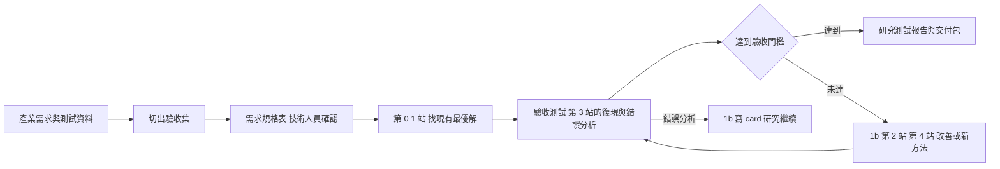

# 產學分支：同一條路，產學計畫多做什麼（v1，2026-10-09）

> 位置：貫穿。**參與產學計畫的人讀**；沒參與的不用讀。
> 實驗室的產學計畫是一魚兩吃：產業方提出需求，我們把它當研究題目做。交給產業方的是**研究與測試報告、程式、實驗結果**，不是產品；產品化是產業方的工程師拿到這些之後，自己分析、打包、延伸的事。
> 你會拿到的只有**產業需求與測試資料**。合約、經費和其他細節由教授處理，你不需要知道；有疑問問教授。
> 這份教材不改寫各站：每站照原教材做，這裡只寫產學計畫**多做什麼**。
> 產出：需求規格表、驗收紀錄、雙週報告（Quarto 投影片＋會後紀錄）、研究測試報告、交付包。模板在本資料夾的 [`templates/`](templates/)。

---

## 0. 前提：專案是 group 的，研究是自己的

一個產學專案由一個 group 一起完成；每個人的研究仍然是自己的——從專案需求出發，在自己的研究 repo 裡走第 0–6 站。兩條線分開放、分開報：

| | 專案（group 共同） | 研究（每人自己） |
|---|---|---|
| 做什麼 | 需求規格表、驗收測試、改善、研究測試報告與交付包 | 第 0–6 站，目標是投論文 |
| 放哪 | 專案 repo（教授建立或指定） | 自己的研究 repo（第 0 站建） |
| 對誰報 | 產業方的技術人員，**雙週一次** | 教授與 lab，每週 group meeting |
| 誰報 | group 協調誰報 | 每個人都報 |
| 格式 | 6 頁雙週報告投影片＋會後紀錄（§5） | 8 頁進度投影片（第 5 站），不因產學縮水 |

**專案 repo 的原則：裡面的東西，預設都是產業方可以看的。** 不能給產業方看的——你的 idea log、論文筆記、還沒發表的想法、lab 其他人的研究——留在研究 repo，不搬進來。守住這條，交付（§7）就不會出錯。

專案 repo 的結構（建議；放在哪、叫什麼、誰有權限由教授定）：

```
〔專案 repo〕/
  README.md               專案一句話、需求規格表版本、目前驗收狀態、誰負責哪一塊
  spec/
    requirement_spec.md   需求規格表（§2）；改版時舊版另存，不覆蓋
  eval/                   驗收腳本：讀測試資料、算指標，一行能跑（§3.1）
  results/
    acceptance.csv        驗收集每跑一次記一行（§3.1）
  meetings/
    biweekly_YYMMDD.qmd   雙週報告與 render 出的 html（§5）
    minutes_YYMMDD.md     會後紀錄（§5.5）
  report/
    test_report_vN.qmd    研究測試報告與 render 出的 html、docx（§6）
  delivery/               交付包（§7）
  pyproject.toml          uv 環境，規則同第 3＋4 站 §2；uv.lock、.python-version 一起進 git
  .gitignore              測試資料不進 git
```

專案 repo 不是從 `student-template` 建的（那是個人研究 repo 的範本）；建好之後把本資料夾 `templates/` 的模板複製進去。

---

## 1. 從需求到驗收：產學版的路徑



1. **拿到需求與測試資料**（教授轉給你）：第一件事是切出驗收集（§3.1），第二件事是寫需求規格表（§2）
2. **需求規格表給技術人員確認**：第一次雙週會議就做。驗收指標和門檻沒確認之前，「符不符合」無從判斷
3. **找現有最優解**：照第 0、1 站做，多一個目標——選出 1–3 個現有最好的方法，當驗收測試的對象（§4）
4. **驗收測試**：照第 3 站，先在公開 benchmark 上復現到對上論文數字，再到產業方的開發集上跑、做錯誤分析；最後在驗收集上跑一次，記進 `acceptance.csv`
5. **判定**：
   - 達到門檻 → 寫研究測試報告（§6）、整理交付包（§7）。錯誤分析照做，研究繼續（§8）
   - 未達 → 走 1b → 2 → 4：寫 card、畫 Table 1、改善或提出新方法；每改善一輪，回到第 4 步再驗收

和主線的差別：主線是先出題（1b、2）再復現（3）；產學是**先驗收現有方法（3），再出題**。這不衝突——主線本來就有「第 3 站錯誤分析後回 1b」這條回頭路，產學只是一開始就走它。走改善那條路時，現有最優解就是 Table 1 的必備 baseline，而且已經復現過了。第 3 站的鐵律照舊：**復現沒對上之前，不改方法。**

---

## 2. 需求規格表

產業方寫的需求通常是業務語言：「客服錄音裡的產品型號要辨識得準」。你的工作是把它改寫成**每一格都能檢查**的規格，讓「符不符合」變成一個算得出來的答案。這是業界做專案的基本功：需求沒寫到能驗收，報告交出去就只能寫「效果不錯」，最容易起爭議。

模板 [`templates/requirement_spec.md`](templates/requirement_spec.md) 有十格：

| 格 | 寫什麼 | 為什麼要你自己寫 |
|---|---|---|
| 1 一句話需求 | 用技術語言重寫：任務、輸入、輸出 | 寫不出來，表示你還沒懂需求 |
| 2 使用情境 | 誰在用；輸入長什麼樣：語言、口音、錄音設備、取樣率、長度、雜訊；即時或離線 | 決定公開 benchmark 和真實資料差在哪（1b 來源 3） |
| 3 測試資料 | 筆數、時數、怎麼標的、開發集與驗收集怎麼切、能不能拿來訓練 | §3 的紀律從這格開始 |
| 4 驗收指標 | 指標名稱、**怎麼算**（文字正規化規則寫進附錄）、在哪個集合上算 | 第 3 站 §3.3：WER 差 1–2% 常常只是正規化不同 |
| 5 門檻 | 每個指標的數字、誰定、哪天 | 沒有門檻就沒有「符合」 |
| 6 運行條件 | 硬體（GPU 或 CPU、記憶體）、速度（RTF 或延遲）、能不能用雲端服務 | 現有最優解常常準，但太慢或太大 |
| 7 不在範圍內 | 明確不做的：產品化、介面、部署、需求以外的語言或場景 | 交付的是研究與測試報告；寫出來，雙方就不會期待錯 |
| 8 交付物與時程 | 研究測試報告、程式、實驗結果；日期由教授給 | 時程倒推的起點（§8） |
| 9 待確認 | 你不確定的格子，一格一個問題 | 不確定就問，不要自己補 |
| 10 確認紀錄 | 哪天、什麼場合、誰（寫角色）確認了哪幾格、哪一版 | 之後有爭議時的依據 |

規則：
- **每格要能檢查。**「辨識要準」不算；「驗收集上 CER ≤ 〔x〕%，正規化依附錄 A」才算
- **門檻產業方給不出來，由教授和產業方定，不由你猜。** 你可以準備參考數字帶去：現有最優解在公開 benchmark 上的表現、文獻裡同類任務的範圍（Round 1 §4 的表）
- **規格改了，版本號加一，舊版留著。** 改規格要經教授同意（§5.4 第 1 條）；確認紀錄寫清楚確認的是哪一版

示例（**示例，情境與數字虛構**）：

```markdown
# 需求規格表 v1（2026-10-20）

1. 一句話需求：把客服通話錄音轉成文字，產品型號（英數混合，如 AX-3200）要正確
2. 使用情境：電話錄音 8 kHz 單聲道；華語夾英數；每通 2–10 分鐘；離線批次處理
3. 測試資料：120 通、約 9 小時，人工逐字稿；開發集 40 通、驗收集 80 通，依通話切；可否用於訓練：待確認
4. 驗收指標：(a) 全文 CER；(b) 型號召回率＝正確辨識的型號數 ÷ 逐字稿裡的型號數；兩者都算在驗收集上，正規化見附錄 A
5. 門檻：CER ≤ 12%；型號召回率 ≥ 90%
6. 運行條件：單張 24 GB GPU；RTF ≤ 0.3；不可用雲端 API
7. 不在範圍內：即時串流、使用介面、部署、臺語
8. 交付物與時程：研究測試報告 v1、程式、實驗結果；日期〔教授給〕
9. 待確認：開發集可不可以拿來微調？
10. 確認紀錄：2026-10-20 雙週會議，產業方技術人員確認第 1–7 格，規格 v1
```

---

## 3. 資料的紀律

### 3.1 切出驗收集，開發時不看

如果你只有一份測試資料，又一直在上面調參數，交出去的數字會偏高：產業方的工程師換成自己的資料一跑，數字就掉。所以拿到資料第一天就切成兩份：

| 集合 | 能做什麼 | 不能做什麼 |
|---|---|---|
| 開發集 | 調參數、錯誤分析、聽樣本 | — |
| 驗收集 | 交報告前跑，結果記進 `acceptance.csv` | 聽樣本、調參數、挑 checkpoint |

- **依通話或說話人切，不依句子切**：同一個人的聲音不能同時出現在兩邊，否則驗收集的數字也會偏高
- 資料太少、切不出有意義的驗收集 → 拿到資料當天問教授
- **驗收集每跑一次都記一行，寫明為什麼跑。** 跑太多次，就等於拿它調參數了。`acceptance.csv` 的表頭（模板 [`templates/acceptance.csv`](templates/acceptance.csv)）：

```
date,commit,system,test_set,metric,value,threshold,pass,conditions,reason
```

`conditions` 寫硬體、解碼設定、checkpoint；`reason` 寫為什麼跑（例：「研究測試報告 v1」）。

- **驗收腳本兩個人各寫一份。** `eval/` 的腳本由 group 裡另一個人不看你的程式、照需求規格表第 4 格與附錄 A 獨立寫一份，兩份對同一組輸出算出同樣的數字才算數——和第 3＋4 站 §6 第 5b 條的評測盲測同一個道理。驗收指標算錯，整份報告都不算數

### 3.2 不進 git，不進外部 AI 服務

- 測試資料放教授指定的機器與路徑；專案 repo 的 README 只寫路徑、檔案數、總時數與檔案清單的 md5。`.gitignore` 照第 3＋4 站的範本擋掉資料夾與音檔
- **產業方的東西預設不進任何外部 AI 服務**：音檔、逐字稿、需求文件、需求規格表、雙週報告、技術人員的來信，都不貼進 ChatGPT、Claude、Gemini 等雲端 AI 工具（含 Deep Research），也不送雲端語音 API 測試。例外由教授決定
- 在 lab 機器上跑開源模型（例如下載 Whisper 的權重，在 lab 的 GPU 上推論）不算外部服務——那就是驗收測試本身
- Lab-Hub 是公開 repo：在那裡開 Issue 問教材時，不提產業方、專案名稱或資料內容

AI 在產學裡能用在哪：

| 可以 | 不可以 |
|---|---|
| 第 0、1 站的 Deep Research：題目欄寫你**自己改寫的一般情境**（例：「電話錄音裡的英數混合型號常被認錯」） | 把需求文件或需求規格表貼進指令 |
| 問 toolkit、Quarto、程式怎麼寫；給 AI 的程式碼不含產業方的資料與名稱 | 把產業方的錯誤樣本、逐字稿給 AI 發散（1b §6.2 只用公開資料上的錯誤分析，或只給類別名稱與比例） |
| 整理公開 benchmark 上的結果 | 用 AI 生雙週報告或研究測試報告——內容含需求與產業方資料的結果，照模板自己填 |

### 3.3 論文裡的產業方資料

論文的主實驗在公開資料上（第 2 站 §4 的硬規則）；產業方的資料放在 C 層的位置：第二個資料集或分析用集，永遠不是唯一的評測集。它能不能出現在論文裡、以什麼形式出現（名稱、數字、描述），由教授告訴你（§10）。

---

## 4. 各站多做什麼

表的順序就是產學版的順序（§1）。

| 站 | 照原教材做 | 產學多做 |
|---|---|---|
| 0 | Round 1 建地圖 | 題目欄寫改寫過的一般情境（§3.2）；§8 商機用來看產業方所在市場的現有產品與痛點，幫你理解需求從哪來；§9 的問題加上需求規格表的「待確認」格 |
| 1 | Round 2 深挖 | 多一個目標：選出 1–3 個現有最優解當驗收測試的對象，優先挑有開源實作與權重的；one-pager 多寫一行驗收指標與門檻 |
| 3 | 復現＋錯誤分析 | 復現的對象就是現有最優解。順序：公開 benchmark 上對上論文數字 → 產業方開發集上跑 → 開發集上做錯誤分析（100 個親耳聽）→ 驗收集跑一次（§3.1）。第 3 站開頭要求的「第 2 站審核紀錄」，產學版改為**需求規格表經技術人員確認** |
| 1b | idea card | 痛點可以來自產業需求，但證據要你自己的：驗收測試的錯誤分析（類別與比例）。card 的「最小驗證」優先在公開資料上做 |
| 2 | Table 1 | 產業方的驗收集放 C 層的位置（第二組列或分析表），不是唯一評測集；運行條件有速度限制的，RTF 一定要報（第 2 站 §3.3 第 6 條） |
| 4 | 執行與紀錄 | `results.csv` 照舊記在研究 repo；驗收集的結果另記在專案 repo 的 `acceptance.csv` |
| 5 | 每週 8 頁 | 照報，格式不變；產學的進展放進第 4、5 頁。另有給產業方的雙週報告（§5） |
| 6 | 寫作 | 投稿前要給產業方看，時間由教授告訴你，從截稿日倒推（§8） |

---

## 5. 雙週報告：給產業方的技術人員

### 5.1 讀者要什麼

技術人員懂技術，不需要你從頭講 ASR；但他們不熟你的研究脈絡，也不在乎你的論文。他們每兩週要知道三件事：

1. 離驗收門檻還有多遠
2. 接下來兩週做什麼
3. 需要他們提供或決定什麼

每一頁都在回答這三件事之一。用不上的——文獻脈絡、你的 idea card、還沒測過的想法——不放。

### 5.2 誰報、怎麼準備

- group 協調誰報：可以輪流，也可以看這兩週誰的進展最多。教授出席
- 材料來自這兩週的 group meeting：每個人的 8 頁、`results.csv`、`acceptance.csv`。不為了雙週報告重做實驗或重整日誌
- 雙週報告前的那次 group meeting，報告人花 5 分鐘把草稿給教授看（建議）
- 報告 15 分鐘以內，其餘時間討論（建議；會議長度由教授和產業方定）
- 語言：中文，專有名詞保留英文

### 5.3 頁面：固定 6 頁

模板 [`templates/biweekly_template.qmd`](templates/biweekly_template.qmd)，和第 5 站一樣用 Quarto 產生 html、每頁附演講稿。檔名 `meetings/biweekly_〔YYMMDD〕.qmd`（會議日期）。

| 頁 | 標題 | 內容 |
|---|---|---|
| 1 | 結論 | 一句話現況；驗收狀態表：每個指標一列，欄位是門檻、目前最好、狀態（達標／接近／未達）、測在哪個集合 |
| 2 | 上次待辦 | 上次會後紀錄的待辦逐條：負責、狀態（完成／進行中／未做：原因） |
| 3 | 本期做了什麼 | 2–4 項，每項一行結果，**先數字後過程**；每項標已測、進行中或計畫 |
| 4 | 結果與測試條件 | 一張表或一張圖；下面固定一行測試條件：資料（開發集或驗收集、筆數）、模型與版本、硬體、指標算法 |
| 5 | 失敗案例與風險 | 錯誤分析的前三類（類別與比例，可附一兩個代表樣本）；風險：哪個指標可能達不到、為什麼、打算怎麼處理 |
| 6 | 下期計畫與需要貴方協助 | 下兩週要做的，具體到實驗；需要產業方提供或決定的事，編號 |

第 1 頁就是結論，不鋪陳。技術人員可能只看第一頁，就要回去向主管報告。

### 5.4 六條規矩

學生第一次面對業界，最常出的問題通常不在內容，在這幾件事：

1. **需求或範圍要改，當場只記錄。** 回答「我們記下來，會後和教授確認」。不答應、不估時程；會後紀錄裡標「待教授確認」
2. **每個數字附測試條件。** 不同條件的數字不放在同一張表裡比；驗收集的數字標明「驗收集」
3. **分清做過的和計畫中的。** 用三種標記：已測、進行中、計畫。不說「應該可以」「快好了」
4. **不知道就說不知道。** 「我不確定，會後確認再回覆」，寫進待辦
5. **不談合約、經費、時程承諾，不談 lab 的其他專案與別人的研究。** 被問到就說「這部分請教授回覆」
6. **不給研究 repo、idea log、還沒發表的想法。** 投影片只放和這個專案有關的；對方要程式或資料，會後由教授決定，交付走 §7

### 5.5 會後紀錄

報告的人會後寫，模板 [`templates/minutes_template.md`](templates/minutes_template.md)，檔名 `meetings/minutes_〔YYMMDD〕.md`。內容：日期、出席（寫角色）、決議、待辦（事項、負責、期限）、產業方提出的需求變更（一律標「待教授確認」）、會中答不出的問題、下次會議日期。

寫好先給教授看，由教授寄出，或教授同意後由你寄出。下次雙週報告的第 2 頁就從這份的待辦開始——和第 5 站「新 Issue 第一行引用上週回饋」同一個道理。

---

## 6. 研究測試報告

驗收測試做完並達標，或每一輪改善做完，交一版研究測試報告。讀者是產業方的工程師：他們要靠這份報告和你的程式，自己去分析、打包、延伸。所以標準只有一個：**工程師不用問你，就能重跑出報告裡的數字，並且知道它在哪裡會失效。**

模板 [`templates/test_report_template.qmd`](templates/test_report_template.qmd)，Quarto 一次 render 出 html 與 docx（Word 檔可另存 PDF）。檔名 `report/test_report_v〔N〕.qmd`，每次交付版本號加一。九節：

| 節 | 寫什麼 |
|---|---|
| 1 摘要 | 半頁：需求一句；每個驗收指標一行（門檻、結果、達標與否）；建議 |
| 2 需求與驗收指標 | 引用需求規格表的版本號；指標定義與正規化規則放附錄 |
| 3 測試資料與環境 | 資料描述（筆數、時數、切分方式、標註方式）；硬體；軟體版本（完整版本見 `uv.lock`） |
| 4 比較的方法 | 測了哪些方法、為什麼選它們（附論文）、各自的實作與權重版本 |
| 5 結果 | 驗收集主表；公開 benchmark 對照（和論文數字對上）；代價：RTF、記憶體、參數量 |
| 6 錯誤分析 | 類別與比例、代表樣本、人聽得出但模型錯的比例 |
| 7 限制與已知問題 | 在什麼條件下會失效；哪些條件沒測到 |
| 8 重現步驟 | 程式在哪、`uv sync`、一行指令重跑驗收、預期得到的數字 |
| 9 給工程師的建議 | 延伸或部署時要注意的事；不寫成產品設計 |

- **第 5 節的公開 benchmark 對照不能省。** 它是工程師相信你的實作沒錯的依據，和第 3 站「復現對上，才有資格說自己的方法贏」是同一件事
- **第 7 節要誠實。** 工程師最怕的不是數字不夠好，是上線後才發現某類輸入全錯。錯誤分析看到的失敗類別，全部寫進來
- **交出去之前**，group 裡另一個人照第 8 節，在乾淨的環境（新 clone、新 `uv sync`）重跑一次，數字對上才交

---

## 7. 交付包

交付包放專案 repo 的 `delivery/`（或教授指定的地方），由教授交給產業方。

| 放 | 不放 |
|---|---|
| 研究測試報告（html、docx 或 PDF） | 研究 repo 的 `notes/`：idea log、論文筆記、日誌 |
| 重跑所需的程式：模型程式、config、驗收腳本 | 還沒發表的方法（要不要交，由教授決定） |
| `pyproject.toml`、`uv.lock`、`.python-version` | lab 其他人的程式 |
| 報告用到的結果：`acceptance.csv` 與相關的 `results.csv` 列 | 金鑰、帳號、機器的登入資訊 |
| README：安裝、怎麼跑、預期數字 | 產業方以外、授權不允許轉交的資料 |
| 授權表：每個用到的預訓練模型、資料集、套件，各自的授權 | |

- **從研究 repo 複製需要的檔案，不是把研究 repo 給出去。** 這就是第 3＋4 站說的「toolkit 要釋出時再拆」
- **授權表一定要有。** 產業方要拿去做產品，而有些預訓練模型或資料集的授權不允許商用。逐項查原始授權頁寫上（請自行查證，不要讓 AI 查）；查不到的標「未確認」，交教授判斷
- checkpoint 要不要交、怎麼交，問教授
- 交付前在乾淨的環境照 README 跑一次；打一個 git tag `delivery-v〔N〕`，和研究測試報告的版本號一致

---

## 8. 一魚兩吃怎麼不斷

- **達標不等於研究結束。** 現有方法剛好過門檻，專案可以交差；但「把現有方法在新場景測一遍」很難投 top conference。錯誤分析照做，看它在哪類輸入上還會失敗，回 1b 寫 card；要不要繼續做成論文，由教授決定
- **論文要在公開資料上成立。** 產業方資料是第二個場景，不是主戰場。公開 benchmark 上贏、真實場景上也贏，是很強的論文；只在產業方資料上贏，審稿人會讀成工程報告（§9b）
- **兩條時程畫在同一張表。** 雙週報告、交付日、會議截稿日、投稿前給產業方看的時間，全部放進你的時程表（Round 2 one-pager 從截稿日倒推的那張）；看到衝突，提早一個月告訴教授
- **月度停損照樣適用。** 產學的工作（驗收、報告、交付）也是進度，但每週 8 頁第 4 頁的「距上次新數字」算的是研究的 Table 1。產學工作佔滿、研究超過 4 週沒有新數字，那次 group meeting 一樣要討論（第 5 站 §3）

---

## 9. 怎麼核對

1. 需求規格表每一格都能檢查；「待確認」每一格都有人在追；確認紀錄有日期與版本
2. 雙週報告的每個數字，對得回 `acceptance.csv` 或 `results.csv` 的某一列，測試條件寫齊
3. `acceptance.csv` 的列數就是驗收集被跑過的次數，每一列都有理由
4. 驗收腳本兩個人各寫一份，數字一致
5. 研究測試報告第 8 節，由 group 另一個人在乾淨環境重跑對上
6. 交付包裡沒有 `notes/`、沒有金鑰；授權表每一列都填了
7. 沒有任何產業方的東西進過外部 AI 服務

---

## 9b. 審稿人會怎麼看這一站的產出

產學做得好，論文會更強；做得不好，論文會被當成工程報告。審稿人會問：
- **「只在私有資料上的結果，我怎麼比？怎麼重現？」** 所以主實驗在公開資料上（第 2 站 §4）；產業方資料只能補充
- **「真實場景」的宣稱有沒有證據？** 公開 benchmark 上贏，再加上真實資料上也贏，才撐得起這個宣稱。論文裡要寫清楚資料的描述（時數、說話人數、領域、錄音條件）和為什麼不能公開；很多會議的 checklist 會問資料能不能公開，請自行查證目標會議的規定
- **「有沒有在測試集上調參數？」** §3.1 的驗收集紀律就是答案：`acceptance.csv` 的每一列都說得出為什麼跑
- 研究測試報告的第 7 節（限制與已知問題）＝論文的 limitation 段。寫給工程師的誠實，搬到論文裡一樣成立

---

## 10. 要問教授的事

| 問題 | 什麼時候問 |
|---|---|
| 專案 repo 放哪、叫什麼、誰有權限？ | 拿到專案時 |
| 測試資料放哪台機器、哪個路徑？ | 拿到專案時 |
| 交付日期與里程碑？（只要日期） | 拿到專案時 |
| 發表限制三件：能不能投、投稿前要給產業方看多久、產業方資料的結果能不能寫進論文 | 拿到專案時；選目標會議之前一定要知道 |
| 資料太少，切不出驗收集怎麼辦？ | 拿到資料當天 |
| 門檻產業方給不出來，怎麼定？ | 寫需求規格表時 |
| 產業方提出需求變更，接不接？ | 會後當天 |
| 會後紀錄誰寄？ | 第一次雙週會議前 |
| 未發表的方法、checkpoint 要不要交？授權不允許商用的模型怎麼辦？ | 整理交付包時 |
| 某樣東西能不能給 AI 處理？（預設不行） | 任何時候，用之前 |

範圍、資料、交付、發表都由教授決定；這份教材只教你帶著準備好的東西去問。

---

## 修改紀錄

### v1（2026-10-09）
- 初版草稿，待使用者審。設計決策見 `CLAUDE.md` 第五節「產學分支」：放 Lab-Hub；交付研究與測試報告、程式、實驗結果，不做產品；學生只知道需求與測試資料；group 一起做專案、研究各自做；雙週對產業方技術人員報告（Quarto 投影片＋會後紀錄、中文、group 協調誰報、教授出席）；產業方資料預設不進外部 AI 服務；發表限制由教授每案告知
