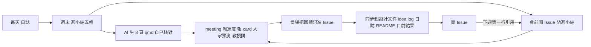

# 進度報告：group meeting 怎麼報（v1.4，2026-10-08）

> 位置：第 5 站。每週一次，**從第 2 站（Table 1 審過）起**一直到投稿。第 0、1 站不做每週進度報告，只報兩次：Round 1 做完報一次（第 0 站結尾 (b) 的 10 分鐘骨架，可請 AI 做成 Quarto），Round 2 做完把 one-pager 給教授看一次（§1 末尾）。
> 這一站沒有新方法，材料全部來自前幾站：日誌的週小結（第 4 站）、Table 1 的填格進度（第 2 站）、一張 idea card（1b）。教材教的是怎麼把這些組裝成 30 分鐘，以及怎麼留下教授說過的話。
> 產出：每週一份投影片（Quarto 產生的 html，含演講稿）＋一個 GitHub Issue（週報與教授回饋的紀錄）。
> 投影片固定 8 頁（§3），前兩頁每週重複放：問題定義的示意圖、idea 或架構的示意圖——讓聽的人先回到你的題目，再聽進度。

---

## 0. 這一站怎麼接前後

- 輸入：`notes/log.md` 的本週小結（第 3＋4 站 §1.3）、`_design.md` 的 Table 1（第 2 站）、`idea_log.md` 裡最新的一張 card（1b）
- 輸出：教授在 Issue 裡的回饋 → 下週報告的第一行、`_design.md` 的審核紀錄、card 的狀態與代碼
- 兩份紀錄分工：**給自己看的是 Markdown**（repo 裡的日誌，當天寫），**給教授看的是投影片**（每週從日誌整理出來）。投影片的每個數字都要能在日誌和 `results.csv` 找到

---

一週的循環：



## 1. 會議結構

每週一次，partner 一定出席。兩段：

| 段 | 誰報 | 時間 | 內容 |
|---|---|---|---|
| 進度報告 | **每個人每週都報** | 每人 30 分鐘（報告不超過 10 分鐘，其餘討論） | 本教材 |
| 論文報告 | partner 組內輪流，每週一人 | 一篇 20 分鐘 | 格式見 `guides/paper_reading/paper_to_slides.md`；本站只管排程 |

順序固定：先所有人的進度報告，再論文報告。進度報告內部的順序也固定（1b §5）：

1. 報進度
2. 報自己的 idea card（至少一張，新的或改過的）
3. 在場每個人各一句：預測教授會怎麼判這張（1b §5）
4. 教授講他的判斷與想法
5. 討論

第 4 步在第 2、3 步之後，不可以反過來。

**第 0、1 站的兩次報告**（不是每週）：Round 1 核對完，在 group meeting 用報告結尾 (b) 的 10 分鐘骨架報一次，接著問 §9 的問題，教授定路線；Round 2 核對完，one-pager 給教授看（group meeting 或一對一都可以），教授定題目與里程碑。這兩次之後才進 1b 與第 2 站，每週報告從第 2 站開始。

---

## 2. 報告的內容：五格

投影片的內容就是日誌週小結的五格（第 3＋4 站 §1.3），排序不變：

| 格 | 寫什麼 | 第一行放什麼 |
|---|---|---|
| 1 對帳 | 上週說要做什麼（原文貼過來）、做到了沒；沒做到說為什麼 | 上週教授的回饋（從 Issue 引用） |
| 2 做了什麼 | **先數字後過程**：Table 1 填了哪幾格、數字多少；過程只講和結果有關的 | 「Table 1 填了 N 格」 |
| 3 卡住 | 第 3 站的三行：問題是什麼、試過什麼、現在卡在哪 | 最卡的那一個 |
| 4 Card | 一張，照 1b 的八格；改過的只講改了哪格 | card 編號與一句話標題 |
| 5 下週與要問 | 下週要做什麼（具體到 run）；要教授決定的事 | 要教授決定的事 |

不報的東西：看過但沒結果的；跑失敗的 run 一句話帶過；「這週很忙」。

---

## 3. 進度投影片的頁面

8 頁，每頁都有演講稿（speaker notes）。**前兩頁每週固定**，內容不變就直接沿用上週的，有改才改：

| 頁 | 標題 | 內容 | 演講稿寫什麼 |
|---|---|---|---|
| 1 | 問題定義 | 一張示意圖：你的題目在解什麼、原本的做法在哪裡壞掉（第 2 站決策紀錄的「一句話主張」畫成圖） | 一句話：我在解什麼 |
| 2 | Idea 或架構 | 一張示意圖：你的 idea card 的假設，或第 2 站的 method figure（新成分用不同框標出） | 一句話：我動的是哪一格 |
| 3 | 對帳 | 兩欄：上週說要做／實際做到。沒做到的標紅 | 沒做到的原因，一句 |
| 4 | Table 1 現況 | 整張 Table 1；本週新填的格子加粗；還空的格子留 `—`；右上角一行「距上次新數字：N 週」 | 每個新格子的數字從哪個 run 來 |
| 5 | 本週關鍵結果 | 一張圖或一張小表；只放最重要的一個 | 這個結果代表什麼、和預期差在哪 |
| 6 | 卡住 | 三行：問題／試過／卡在哪 | 想請教授或 partner 幫什麼 |
| 7 | Idea card | 八格的精簡版：痛點、假設、最小驗證、最接近的 prior work | 為什麼這張值得做；沒把握的地方 |
| 8 | 下週與要問 | 下週要跑的 run 清單；要教授決定的事（編號）；本週淺讀了哪 2 篇（短名） | 無 |

**月度停損**：第 4 頁那行「距上次新數字」超過 **4 週**，那次 meeting 固定討論一件事：換題、砍格子，還是再給兩週。規則寫死是為了不用誰先開口——學生不會提，教授也可能因為沉沒成本不提。

規則：每頁一件事；表格不縮小到看不見，Table 1 太寬就拆成兩頁；圖要有軸標籤與單位；**不要美化**——主題用 Quarto 預設的就好，時間花在內容上。前兩頁的圖畫一次之後每週沿用，題目或 idea 變了才重畫；它們的用途是讓聽的人（和三週沒看你 repo 的教授）先回到你的題目。

---

## 4. 用 Quarto 做投影片

Quarto 是把 Markdown（`.qmd`）轉成投影片（reveal.js 的 html）的工具，演講稿寫在 `::: {.notes}` 區塊裡，簡報時按 `S` 開演講者視窗就看得到。安裝與用法請自行查證 Quarto 官網的最新說明；下面是最小流程。

### 4.1 檔案位置

repo 裡開 `reports/` 資料夾：

```
reports/
  progress_261008.qmd   本週的投影片原始檔
  progress_261008.html  render 出來的檔，commit 進去
```

`261008` 是開會日期（YYMMDD）；檔名和 Issue 標題用同一個日期（§5）。html 一起 commit 是為了教授直接在瀏覽器開；若 lab 有開 GitHub Pages，網址貼進 Issue。

### 4.2 qmd 骨架

範本 repo 的 `reports/_template_progress.qmd` 就是 8 頁的骨架，YAML（1280×800、講稿數學腳本）已設好；複製成 `progress_〔YYMMDD〕.qmd` 填內容。每頁長這樣：

```markdown
## Table 1 現況

距上次新數字：〔N〕週

〔從 design 貼整張表，本週新填的格子加粗〕

::: {.notes}
〔每個新格子來自哪個 run_id〕
:::
```

render：

```
quarto render reports/progress_261008.qmd
```

### 4.3 請 AI 做投影片

可以把日誌週小結、Table 1、card 一起丟給 AI，請它產生 qmd。可整段複製的指令：

```
附件是我本週的實驗日誌週小結、目前的 Table 1、以及一張 idea card。
請依下面的八頁結構產生一份 Quarto revealjs 投影片的 .qmd 原始檔，每頁附 ::: {.notes} 演講稿：
1 問題定義（放我附的示意圖 figs/problem.png，講稿一句話）
2 Idea 或架構（放我附的示意圖 figs/idea.png，講稿一句話）
3 對帳（上週說要做／做到了沒）
4 Table 1 現況（整張表，本週新填的格子加粗）
5 本週關鍵結果（只放一個）
6 卡住（問題／試過什麼／卡在哪）
7 Idea card（痛點、假設、最小驗證、最接近的 prior work）
8 下週要做與要問教授的事
要求：
- 只用我提供的數字與文字，不要補任何數字、不要替我下結論；資料裡沒有的格子留〔〕讓我填
- 演講稿用口語，每頁 3–5 句，繁體中文（臺灣用語），專有名詞保留英文
- 不要加主題或樣式設定，用 revealjs 預設
- 輸出單一 .qmd 檔的完整內容
```

AI 做完你要做的事：每一個數字對回 `results.csv`；每一句結論問自己「這是我的判斷還是它的」；演講稿自己念一遍，不順的改掉。

---

## 5. GitHub Issue：週報與教授回饋的紀錄

教授的回饋要留痕，用 repo 的 Issue：

1. **會前**：在自己的 repo 開一個 Issue，標題 `〔261008〕 進度`，內容貼週小結五格＋投影片的連結或路徑。加 label `progress`
2. **會中**：教授的回饋與決定，由你當場在 Issue 下留言記錄；教授也可能自己留言或另開 Issue。**當場寫**，不要會後憑記憶補——細節會掉。你記的版本教授看過沒異議就算數，有出入以教授的留言為準
3. **會後**：教授的留言裡有決定的（例如「card C03 通過」「Table 1 砍掉 B 資料集」），同步寫進對應的檔案：`_design.md` 的審核紀錄、`idea_log.md` 的狀態、`notes/log.md`；README「目前結果」更新成最新的 Table 1。然後關掉 Issue
4. **下週**：新 Issue 的第一行引用上週教授的留言（`#12` 之類的連結），對帳就從這裡開始

要問教授但不急的事，另開 Issue，label `question`；教授回了就關。這是「要問教授的事」清單的收件匣，比聊天軟體好找。

Label 三種：你開的週報 `progress`、你的問題 `question`、教授自己開的 `prof`。repo 建好第一天就把三個 label 建起來（Issues → Labels → New label）。

教授要看得到這些，前提是他在你的 repo 裡是 collaborator——第 3＋4 站開 repo 時就要加；忘了加，Issue 開了他也看不到。

教授會在會議之外看 repo——`results.csv` 有沒有動、Issue 有沒有新問題。所以日誌當天寫，Issue 當週開。

---

## 6. 時間怎麼用

30 分鐘含討論：報告 10 分鐘以內，剩下討論。10 分鐘報八頁：前兩頁合計 1 分鐘（只是回顧）；對帳與下週各半分鐘；Table 1 與卡住各 3 分鐘；其餘 2 分鐘。

超過 10 分鐘通常是：講了過程不講結果；一頁放了三件事；Table 1 一格一格念。

---

## 7. 論文報告（排程）

每週一人，partner 組內輪流，一篇 20 分鐘。論文由報告的人選、教授可以指定；原則是和 partner 組的議題相關，而且是自己讀過全文的。投影片同樣用 Quarto；頁面格式見 `guides/paper_reading/paper_to_slides.md`。**每三次輪到一次「審稿預測練習」**（同教材 §10）取代一般的論文報告。

輪到的那週，進度報告照報，不因為要報論文而縮水。

---

## 8. AI 怎麼用

- 可以：把日誌整理成投影片（§4.3）、檢查投影片有沒有漏格、潤演講稿
- 不可以：讓 AI 補數字、替你寫「結論」或「下週計畫」、生成 card
- 報告裡若有 AI 的產出（例如 Round 1 報告的某段、AI 幫畫的圖），講的時候要標明；和第 0 站的規則一致

---

## 9. 示例

> **示例，數字虛構。** 延續 contextual biasing STT。

週小結（來自 `notes/log.md`）：

```markdown
### 本週小結（10/13–10/17）
- 對帳：上週說要做「復現 deep biasing 對上數字」→ 做到了
- Table 1 填了：deep biasing R 格 test-other WER 9.1、B-WER 21.4（run 20261019_deepbias_s0）；距上次新數字 0 週
- 卡住：20261018 OOM，batch 減半重跑，已解
- Card：C03 新的，來源 2
- 下週與要問教授：錯誤分析 100 個樣本；開始 C03 的 pilot 資料準備；pilot 用 train-clean-100 夠嗎
- 本週淺讀：icassp_2026_lee、arxiv_2026_wang
```

對應的投影片第 4 頁（Table 1 現況）就是整張 Table 1，deep biasing 那列的 test-other 兩格加粗；第 5 頁放復現紀錄的那三行（論文數字 20.8、我的 21.4、相對差距 2.9%）；第 6 頁是 OOM 那件事（已解決，一句話帶過）；第 7 頁是 card C03；第 8 頁列「錯誤分析」「pilot 資料準備」兩項與一個要問的問題。

Issue `261015 進度` 的第一行：

```markdown
上週教授回饋（#12）：「復現算過了，錯誤分析先做，pilot 等分析結果再定資料集。」
→ 本週照做；pilot 資料集的問題改到錯誤分析之後再問。
```

---

## 10. 怎麼核對

1. 投影片裡每個數字在 `results.csv` 找得到那一行
2. 第 3 頁的「上週說要做」和上週 Issue 的第 5 格一字不差
3. 每個「教授說」在 Issue 留言裡找得到；Issue 裡的決定都已同步到對應檔案（審核紀錄、idea log）
4. 演講稿自己念過

---

## 11. 要問教授的事

| 問題 | 什麼時候問 |
|---|---|
| 這週的論文報告輪到誰？ | 學期初排一次，寫在 lab 的共用行事曆 |
| Issue 的回饋我這樣摘要對嗎？ | 會中當場確認，不要會後猜 |
| Table 1 以目前速度填不完，砍哪幾格？ | 第 5 格，一發現就問 |
| 投影片格式有要改的嗎？ | 前三次報告後問一次 |

---

## 修改紀錄

### v1.4（2026-10-08）
- 加「一週的循環」圖

### v1.3（2026-10-08）
- 每週報告從第 2 站起；第 0、1 站只報兩次（Round 1 的 10 分鐘骨架、Round 2 的 one-pager），寫在開頭與 §1
- §4.2 改為指向範本的 `_template_progress.qmd`；§5 會後加更新 README「目前結果」；§9 示例的週小結改五格
- §1 順序加「預測」一步
- 第 4 頁加「距上次新數字 N 週」與月度停損規則（> 4 週固定討論換題／砍格子）；第 8 頁加本週淺讀；§7 論文報告每三次輪一次審稿預測練習

### v1.2（2026-10-08）
- §5 補 label 三種（progress／question／prof）與 collaborator 提醒
- 週報檔名與 Issue 標題改用開會日期 YYMMDD（`progress_261008.qmd`、`261008 進度`），不用週次
- §3 定稿：由草案六頁改為八頁，前兩頁固定放問題定義示意圖與 idea／架構示意圖，每週沿用；§4.3 指令、§6 時間分配、§9 示例、§10 核對同步
- §5 第 2 條：回饋由學生當場記進 Issue，教授也可能自己留言或開 Issue

### v1.1（2026-10-07）
- §1、§7 補論文報告教材的連結

### v1（2026-10-03）
- 初版。設計決策見 `CLAUDE.md` 第五節：每週一次、進度每人每週 30 分鐘、論文輪流 20 分鐘；學生自己用 Markdown 紀錄、對教授用 Quarto 投影片附演講稿；教授回饋用 GitHub Issue 留痕；partner 不另外報告。§3 投影片頁面為草案，待教授定稿
